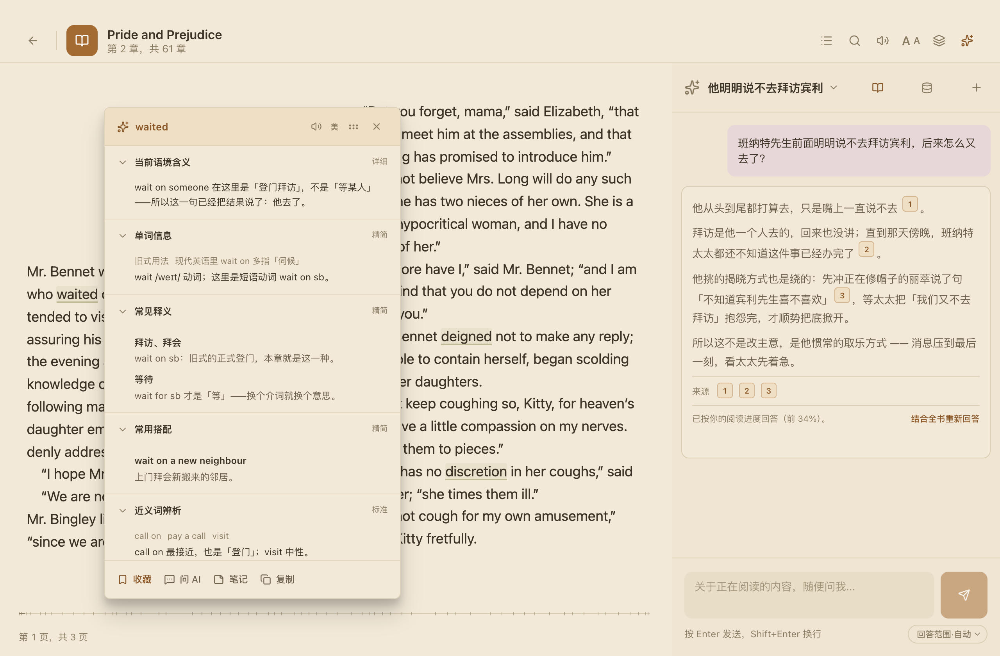
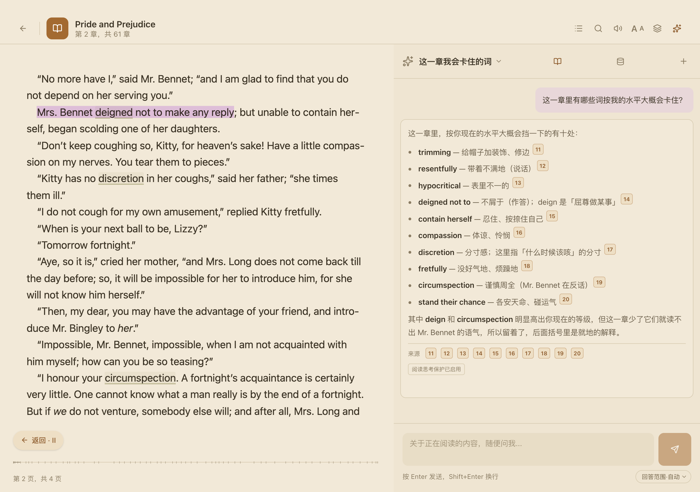
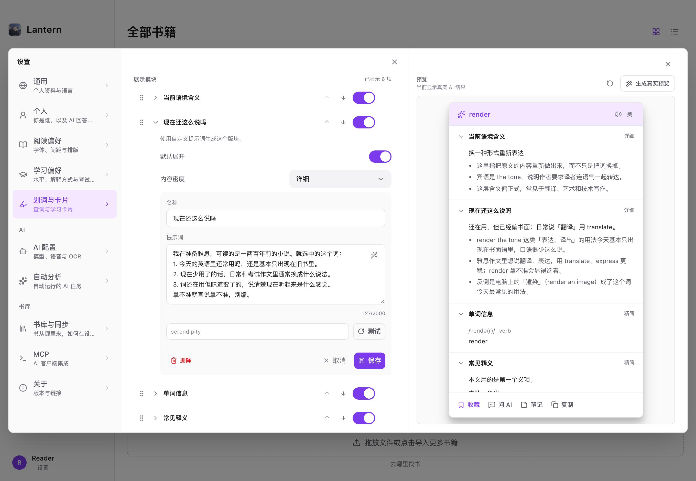

<div align="center">


# Lantern

**Put the AI inside the book, instead of hauling the book into a chat window.**

[](https://github.com/KlaraGraff/lantern/releases)
[](#supported-platforms)
[](LICENSE)

[简体中文](README.md) · [English](README.en.md) · [Download](https://github.com/KlaraGraff/lantern/releases)

</div>

<!-- Screenshot placeholder: full reader view (text + lookup card + AI panel). Shot list in docs/guide/screenshots.md
     Once shot, drop it into assets/screenshots/ and delete this comment’s first and last lines to show it.

-->

---

## You already read with AI — the way you do it is just awkward

You hit a passage you cannot parse. Copy. Switch windows. Paste into a chat box. Ask.

It answers — but it does not know which book you are in, or how far you have read, or what the sentences around this one say, or how good your English is, so it defaults to answering like a native speaker to a native speaker. You finish reading the answer, switch back, and hunt for your place again. And the answer floats free of the book: if you want to check it against the text, you go find the text yourself.

**Lantern works the other way round.** It is a local-first desktop reader for macOS and Windows that runs on your own AI services. Rather than hauling the book into a chat window a passage at a time, it **puts the AI inside the book** — so everything you would otherwise have to explain every single time, it already knows.

Four things follow from that:

1. **It has the context** — your English level, how far you have read, which book and chapter you are in, and what surrounds your selection all travel with every request.
2. **Every line it writes clicks back into the book** — not an answer that stands alone, but one that takes you to the sentence it came from.
3. **What it says, and how, is yours to write** — when a preset module does not fit, write the prompt yourself.
4. **It does not even have to be this AI** — hand your library and vocabulary to Claude Code or Codex over MCP and read with whichever AI you already use.

---

## 1 · It knows far more than a chat window does

A general chat window gets the few lines you pasted into it. Here is what travels with every Lantern request on top of that — **without you saying it, and without you saying it again and again**:

| It knows | So |
| --- | --- |
| Your English level | The wording and sentence complexity move with it, instead of always defaulting to native-speaker prose |
| How far you have read | By default it will not answer from pages you have not reached |
| Which book and chapter | It recognises the names, places, and prior events, so you never have to say "this is from *X*" |
| What surrounds your selection | It settles what the word means *here* first, instead of listing dictionary senses for you to pick through |
| The whole book | Answers are retrieved from the text, not recalled from whatever the model remembers about it |

### It knows your level

In most reading tools, "explain in English" is a switch: turn it on, get near-native English back. For a B1 reader, that explanation is a new obstacle in itself.

Lantern treats your English level as **a condition on every request**, not as a display preference. Set your CEFR level (A1–C2) directly in your learner profile, or enter IELTS, TOEFL, TOEIC, Cambridge English, DET, or CET-4/6 results and let the app estimate a level from them.

| Your level | How the AI explains |
| --- | --- |
| **A1–A2** | An accurate meaning in your first language, plus concise English pitched at your current level. Never harder English to explain easier English. |
| **B1** | Mostly English; first-language support kept where the point is abstract or easy to misread. |
| **B2–C2** | More natural, more thorough explanations in English, with a target-language translation on demand. |

Pitching to a level has a failure mode of its own, though: trading accuracy for simplicity, swapping the precise word for a vaguer one. So there is a hard rule alongside it — **when an explanation genuinely needs a word above your level, the accurate word stays, and it gets glossed inline right where it appears**, in a few simpler English words or a short parenthetical in your own language. **Never replaced with something vaguer, never left there for you to go look up separately.**

So choosing "English first" does not mean accepting native-level prose you cannot parse — the explanation is itself **comprehensible input**. You can start from "just help me understand this" and move toward understanding English in English, without being interrupted a second time by the explanation.

<!-- Screenshot placeholder: learner-level settings, plus the same word explained at A2 and at C1
     Once shot, drop it into assets/screenshots/ and delete this comment’s first and last lines to show it.

-->

### It knows how far you have read

**By default it will not answer from pages you have not reached yet.** Once you know what happens later, your thinking quietly bends toward it — and whatever you would have worked out on your own never gets the chance to surface.

So **reading thought protection** keeps answers inside what you have already read, and says so: *answered up to your reading progress (X%)*. When you do want the full picture, one click answers again using the whole book. The setting is per-book.

How wide it reads is yours to set too: automatic, the selection only, this chapter only, or the whole book.

---

## 2 · Every line it writes clicks back into the book

Before you start a chapter, you can ask it to list every word and phrase in that chapter you might not know. What comes back is a long list — and every entry on it carries a citation marker. **Click one and the book turns to the sentence that word appears in.**

The same holds when you stop mid-chapter to ask about the plot. It does not hand you an answer and leave. It hands you the evidence too, and every piece of evidence is clickable.

This is not "an answer with a reference list underneath." The product that does this best is NotebookLM — but its citations can only take you to a snippet in a side panel. **Lantern *is* the reader, so a citation takes you to the real page, the real sentence**, and flashes the spot so you know where to look.

How it works:

- **Citations are inline.** Markers sit in the body of the answer and repeat as a row underneath it; both are clickable. A vocabulary list citing thirty-odd places stays readable.
- **It finds the position in the text, not a guessed page number.** For EPUB it searches the original snippet inside the known section for a precise location, falls back to a second snippet, then to the section start; PDF jumps to the page; plain text seeks by character offset.
- **Answers are retrieved from the book**, not recalled from the model. Every book gets a full-text index, and if you configure an embedding service, a semantic layer on top — so obscure books, new books and your own documents work just as well.
- **And it inherits the constraints from the section above.** Citations never come from pages you have not reached, and the retrieval scope is yours to set — which is what makes "list the vocabulary before I read" work at all: it scans the chapter you are about to read, not the whole book.

<!-- Screenshot placeholder: an AI answer with citation markers, and the passage it jumps to
     Once shot, drop it into assets/screenshots/ and delete this comment’s first and last lines to show it.

-->

---

## 3 · Built-in modules are a starting point — build your own

What belongs on a lookup card? Contextual meaning, part of speech, common senses, collocations, morphology, grammatical role, synonyms, usage, memory aids, the source sentence. Lantern ships all of these — 11 modules for words, 8 for phrases, 9 for passages — and each one can be toggled, reordered, set to open or collapsed, and given its own content density.

**But a preset should not decide how you study.**

When the built-ins are not enough, build your own AI module:

- Name it, and write **a prompt that is entirely your own** (up to 2,000 characters).
- Have it work from the current selection, the surrounding context, and the book.
- Add it to the word, phrase, or passage card, and show, hide, reorder, and expand it alongside the built-ins.
- Preview the card structure live in settings; call a real AI only when you want to see actual output.
- Up to 8 custom modules per card kind, plus 6 custom selection actions you can bind to a shortcut or a double-click.

For example, you could build:

- A **long-sentence breakdown** module for IELTS or graduate-entrance prep;
- A **rhetoric, narrative perspective, and tone** module for literary fiction;
- A **terminology, prerequisites, and applications** module for technical books;
- A **reusable phrasing and rewrite suggestions** module for your own writing;
- A **minimal lookup** module that shows the least possible and keeps you in the book.

<!-- Screenshot placeholder: custom module editor (prompt field) + module ordering in card design settings
     Once shot, drop it into assets/screenshots/ and delete this comment’s first and last lines to show it.

-->

---

## 4 · Or bring your own AI

The first three sections are all about the context Lantern hands to *its* AI. But why should its own AI be the only one that gets it?

Lantern ships an **MCP server**. Switch it on and AI clients like Claude Code or Codex can read your reading data directly — **with nothing copied or pasted**:

| They can read | Which is |
| --- | --- |
| Your library | Books, collections, metadata, book text, and chunk-index status |
| Your language profile | Your CEFR level and any IELTS / TOEFL scores you entered — **the same one the built-in AI uses** |
| Your learning record | Vocabulary, mastery state, statistics, lookup history, word-form marks |
| What you left behind | Highlights, bookmarks, notes, in-book chat history, chapter summaries |

29 tools in all. Read-only by default; **write access — importing books, deleting them, creating collections — is a separate switch that ships off**, because handing over your data and handing over control are two different decisions and should not be bundled.

So you can ask, from a terminal: "pick three books from my library I could actually finish at my English level," or "turn everything I marked *learning* this month into a list with example sentences." It reads your real reading record, not a version of it you described from memory.

---

## 5 · All of it is yours to change — and the defaults already did the thinking

The register of an explanation, the reach of a search, the modules on a card — everything in the sections above is one face of the same thing: **almost nothing in Lantern is fixed.** Colours, styles, modules, shortcuts, read-aloud voices, what a card shows, what pops up when you select text — if it can be adjusted, it can be adjusted.

But "everything is adjustable" turns into homework if it means you have to adjust everything before you can start. So every setting has a default, and the defaults were thought about: install it and start reading. You only go looking for a setting once something feels wrong.

Marks in the text are where both halves of that show up most densely.

### Marks: two styles, six dimensions

**Manual marks** and **automatic post-lookup marks** are two entirely separate styles, each with its own colour, opacity, highlight / underline / bold, and font. If you want them to look alike, there is a "follow the manual style" switch.

The defaults were not picked at random. A manual mark is a warm, solid yellow — you made it, so it should be visible. An automatic mark is a very faint brown with an underline — it is a trace left by a lookup, and you should be able to read straight past it. The two differ in **shape**, not only colour, so they can never be confused.

- **Bold and font changes are off by default.** They change how wide the text is, so in paginated mode a mark appearing reflows the page it is on — line breaks and page boundaries shift with it. Colour, background, and underline never move a single character. Turn it on if you want it, but know what it costs.
- **The app draws on the page too**: the range being read aloud is a cool blue wash, and New / Learning / Mastered are three underlines that run from warm orange through teal to a grey dash — one gradient of attention being withdrawn, not four unrelated colours.
- **So picking a colour stops you if it has to.** If the colour you choose sits too close to any of those, settings warns you on the spot and names which one it collides with. That test blends both colours **over the actual paper colour first** and then measures the distance — not a comparison of hex values, because a wash and an underline can be far apart on a colour wheel and indistinguishable once they are on the page. The presets were chosen to sit as far from the system marks as possible, but presets only lower the odds: the hex field and the colour wheel still accept anything.

### Word-form marks: you are marking a word, not a string

You look up `run`. Later in the book come `ran`, `running`, `runs` — to string matching those have nothing to do with `run`, so not one of them gets marked. To a reader they were the same word all along.

So "when marking a word" has three settings, not two:

| Option | What it marks |
| --- | --- |
| This occurrence only | Just here |
| Identical words in this book | Every exact spelling match in the book |
| **Every form of this word** | **Every inflected form**, throughout the book |

**You do not type those forms in.** In the word-form manager, each marked word has a button that asks the AI to generate its forms; one more button fills in every word still missing them (batches of 10, 5 in parallel, one automatic retry on failure, cancellable, with progress).

You can still edit the result. If the AI missed a form or added one that does not belong, type over it — an edited entry is recorded as yours and later bulk generation will not overwrite it.

### The same holds elsewhere

- **Read-aloud source** defaults to automatic: a human dictionary recording for a single word, neural voices for a passage, system voices if either fails. All four remain selectable by hand.
- **Book-source sites** are a list you can add to and delete from, not a fixed roster.
- **What a triple-click selects**, how shortcuts are bound, whether the selection menu prints them at all — all settings.
- **Content density** has an explainer dialog that goes module by module, so you can see what Compact / Standard / Detailed actually add before choosing.

---

## Getting started

1. **Install** — grab the build for your platform from [Releases](https://github.com/KlaraGraff/lantern/releases). On macOS, Gatekeeper asks for confirmation the first time (see [Download](#download) for why).
2. **Add an AI service** — open Settings → AI Services, enter an OpenAI-compatible API, Anthropic, Ollama, or your own gateway, and test the connection. Keys never leave this device.
3. **Drop in a book** — drag an EPUB / PDF / TXT into the library, open it, and **double-click any word**.

To make it yours: set your English level under Settings → Profile, and pick the modules you want under Settings → Card Design.

---

## Everything it does

<table>
<tr><td width="180"><b>AI comprehension</b></td><td>

Contextual lookup · phrase glosses · passage explanations · translation · persistent per-book chat (carries the word, the source sentence, the existing explanation, and your reading position into the conversation) · **every answer carries clickable citations that jump back to the sentence in the book** · full-text retrieval, with a semantic layer on top once you configure embeddings · scope the answer to automatic / selection / chapter / whole book · **reading thought protection** — answers drawn only from what you have already read, leaving the rest for you to work out, with one click to answer again using the whole book · every request shows exactly which passage it quotes, and you can remove it

</td></tr>
<tr><td><b>The learning loop</b></td><td>

Vocabulary list · lookup history · New / Learning / Mastered status · FSRS spaced repetition · a notes centre for notes attached to words and passages, searchable · CSV / JSON vocabulary import and export · jump back to the exact place in the book

</td></tr>
<tr><td><b>Marks in the text</b></td><td>

Automatic marking after a lookup · three matching scopes: this occurrence / every exact match in the book / **every inflected form** (forms generated by AI in one click, editable by hand) · manual highlights · separate styles for manual and automatic marks, each with colour, opacity, highlight / underline / bold and font · a warning when a chosen colour collides with a system mark · the original book file is never modified

</td></tr>
<tr><td><b>Reading</b></td><td>

Warm paper themes and custom page colours · import your own fonts · size, line height, margins, layout · scrolled or paginated · bookmarks · table-of-contents panel · reading progress · multiple windows for multiple books · collection folders for the library

</td></tr>
<tr><td><b>Read aloud</b></td><td>

Four audio sources: human dictionary recordings / system voices / Edge neural voices / any OpenAI-compatible TTS endpoint · picks a source automatically based on what you selected · sentence-by-sentence highlight following · pause and resume where you stopped

</td></tr>
<tr><td><b>AI services</b></td><td>

OpenAI-compatible APIs · Anthropic · Ollama · optional OpenAI OAuth · add several services and rank them · store several keys per service, tried in priority order before output starts · connection testing and model discovery

</td></tr>
<tr><td><b>Integrations</b></td><td>

An MCP server that exposes your library, vocabulary, and notes to Claude Code, Codex, and other AI clients — with write access off by default · OCR for scanned PDFs · an editable list of book-source sites · book metadata editing

</td></tr>
</table>

---

## Supported platforms

| Platform | Support |
| --- | --- |
| **macOS** | macOS 12 Monterey or later, **Apple Silicon only**. The primary platform, with the full feature set. |
| **Windows** | Windows 11 x64 installer. Full local reading and AI features, **without iCloud folder sync**. |
| Intel Mac | No build currently provided. |
| Linux | No release currently provided. |
| iOS | In development, not yet released. See the [roadmap](docs/roadmap/mobile-ios.md). |

---

## Format support

| Format | How it opens | Reading controls | Selection & manual highlights | Automatic vocabulary marks |
| --- | --- | --- | --- | --- |
| **EPUB** | Native | Font, line height, margins, scrolled / paginated | ✅ | ✅ |
| **TXT · Markdown · HTML** | Original kept, converted to a stable internal EPUB | Same as EPUB | ✅ | ✅ |
| **PDF** | Native | Theme, zoom, single / dual page, scrolled / paginated | ✅ where a usable text layer exists | ❌ |
| **MOBI · AZW · AZW3 · FB2 · FBZ** | Foliate's native parsers | Flow controls where the renderer supports them | ❌ | ❌ |
| **CBZ** | Native | Theme only | ❌ | ❌ |

This describes current local import and reader integration. It does not imply DRM support, and it does not guarantee perfect rendering of every publisher-specific variant.

---

## Where your data lives

- **The library is local first.** Books, reading progress, vocabulary, and notes stay on this device.
- **API keys and OAuth tokens live only in a local credential database.** They are never returned to the webview and never take part in sync.
- **For multiple devices**, pick a folder inside your own iCloud Drive in settings and choose the same folder on every Mac. The app keeps its event log, books, and covers there. This version does not use the original Quill iCloud container, and makes no claim of compatibility with the original Quill iOS app or its private iCloud data.
- **AI requests send only the context the current task needs** — never the whole book automatically.

---

## Download

Builds and release notes are published on [Releases](https://github.com/KlaraGraff/lantern/releases).

macOS builds are currently ad-hoc signed, so Gatekeeper asks for confirmation on first run. See [macOS distribution](docs/guide/macos-distribution.md) for the signing and notarization plan. Auto-update stays disabled until this fork has its own signed release channel.

---

## Development

Requires Node.js 22, npm, Rust, and the Tauri prerequisites for your platform. The reader engine (foliate-js) is committed alongside the repository.

```bash
git clone https://github.com/KlaraGraff/lantern.git
cd lantern
npm ci
npm run tauri dev
```

Static checks:

```bash
npm exec tsc --noEmit
npm run lint
cd src-tauri && cargo check
```

Stack: Tauri 2 + Rust + SQLite on the backend, React 19 + TypeScript + Tailwind 4 on the frontend, foliate-js for EPUB rendering. Repository conventions live in [AGENTS.md](AGENTS.md).

---

## Attribution and license

Lantern is based on [Quill](https://github.com/yicheng47/quill) by yicheng47. It is an independently maintained personal edition, not an official release of the original project. Copyright in the original Quill remains with its author; this repository keeps the original [MIT License](LICENSE), including its copyright notice.
</content>
