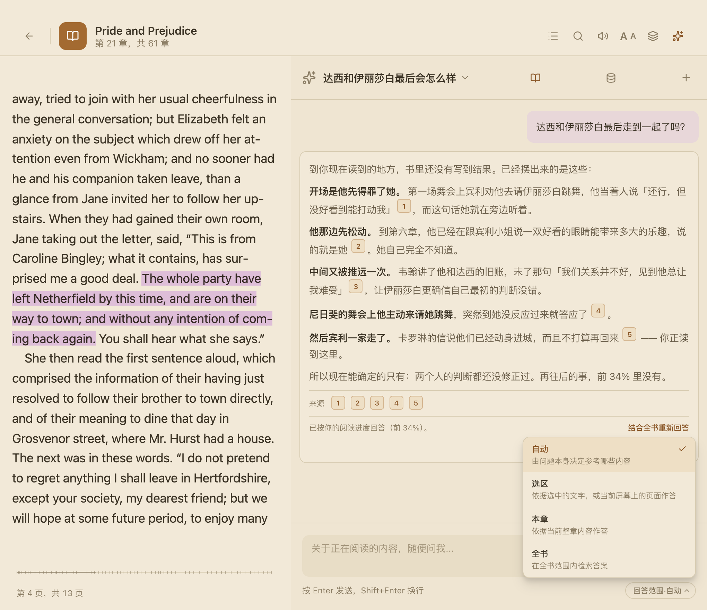
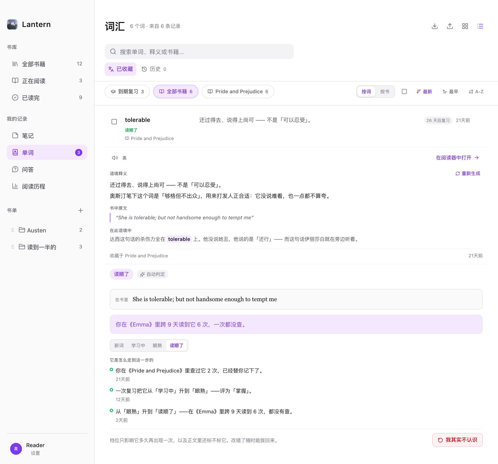
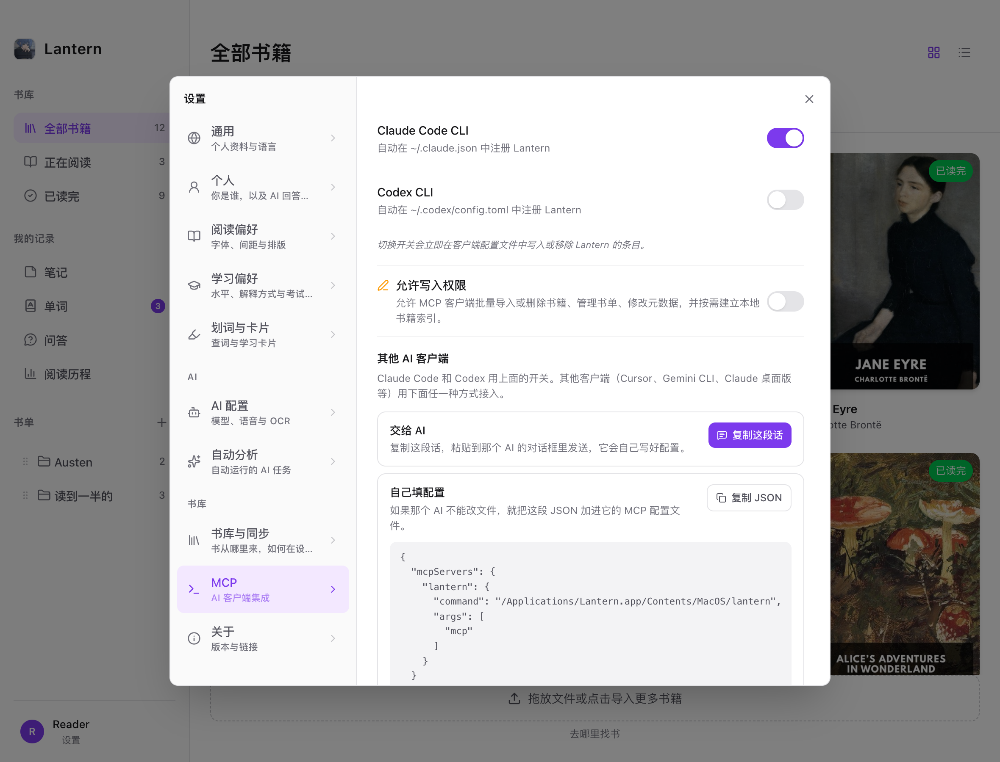

<div align="center">


# Lantern

**把 AI 放进书里，而不是把书搬进聊天窗口。**

[](https://github.com/KlaraGraff/lantern/releases)
[](#支持的平台)
[](LICENSE)

[简体中文](README.md) · [English](README.en.md) · [下载](https://github.com/KlaraGraff/lantern/releases)

</div>

<!-- 样张占位：阅读器全景（正文 + 查词卡 + AI 侧栏）。规格见 docs/guide/screenshots.md

-->

---

## 你早就在用 AI 读书了，只是方式很别扭

读到一段看不懂的，复制，切窗口，粘进聊天框，问它。它不知道你在读哪本书、读到第几章、这句前后写了什么，也不知道你的英语到什么程度，于是默认按母语者的口径回答你。看完切回阅读器，刚才读到哪儿还得再找一遍——而那个答案是悬空的，想核对原文只能自己翻。

**Lantern 是反过来做的。** 它是一款 macOS 和 Windows 上的桌面阅读器，本地优先，用你自己的 AI 服务。它不把书一段一段搬进聊天窗口，而是**把 AI 放进书里**——那些你懒得每次交代的事，它一开始就知道。

具体是五件事：

1. **它拿得到上下文**——你的英语水平、读到哪、在读哪一本哪一章、选中处前后是什么，都随每一次请求过去。
2. **它说的每一句都能点回原文**——给的不是一个孤零零的答案，是能带你回到书里那一句的答案。
3. **你读过的，它自己在记**——哪个词你已经不查了、哪个词你又栽了一次、这本书对你难在哪，都从你读书这件事本身长出来，不用你打卡。
4. **它说什么、怎么说，由你写**——预设模块不合用，自己写提示词造一个。
5. **它甚至可以不是它**——通过 MCP 把书库和生词本交给 Claude Code、Codex，换成你惯用的 AI 来读。

---

## 一 · 它知道的，比一个聊天窗口多得多

一个通用聊天窗口拿到的只有你粘进去的那几行字。Lantern 每次请求带过去的，还有下面这些——**不需要你交代，也不需要你重复交代**：

| 它知道 | 于是 |
| --- | --- |
| 你的英语水平 | 解释的用词和句子复杂度跟着变，而不是永远按母语者的口径来 |
| 你读到哪 | 默认不拿你还没读到的地方来回答你 |
| 你在读哪一本、哪一章 | 认得出书里的人名、地名和前情，不用你每次说「这是《XX》里的」 |
| 选中处前后是什么 | 先定住这个词在这里的意思，再展开——而不是罗列词典义项让你自己挑 |
| 整本书 | 答案是从书里检索出来的，不是靠模型对这本书的记忆 |

### 它知道你的水平

多数阅读工具的「英语解释」是一个开关：打开，就给你一段接近母语者的英文。对 B1 的读者来说，这段解释本身就是新的障碍。

Lantern 把英语水平当作**每一次请求的条件**，而不是界面上的一个偏好。你可以直接填 CEFR 等级（A1–C2），也可以填雅思、托福、托业、剑桥英语、DET 或四六级成绩，由应用换算。A1–A2 以准确的中文义打底，配一句当前水平读得懂的英文；B1 以英文为主，抽象和易误解处保留中文辅助；B2–C2 给更自然、更深入的英语解释。

但「照顾水平」很容易滑向另一个毛病：为了简单而牺牲准确。所以还有一条硬规矩——**解释里如果非用一个超出你水平的词不可，那就保留它，并且当场就地加注**，用几个更简单的英文词或一个中文括注说清楚。**不许换成更含糊的词，也不许扔在那儿让你另外去查。**

选「英语优先」因此不等于接受看不懂的母语级解释——解释本身也是**可理解的输入**。

<!-- 样张占位：学习偏好设置，以及同一个词在 A2 与 C1 下的两张查词卡对比

-->

### 它知道你读到哪

**它默认不会拿你还没读到的地方来回答你。** 一旦提前知道后面发生了什么，你的思路会不自觉地朝那个方向收拢——你本来会自己琢磨出来的东西，就没有机会出现了。

所以「阅读思考保护」把回答限制在你已读过的范围内，答案上标明「已按你的阅读进度回答（前 X%）」；确实想要完整答案时，点一下「结合全书重新回答」。这个开关可以按书单独设，检索范围也由你定：自动、只看选区、只看本章、或者全书。

这条边界也延伸到人物和术语。读到一个想不起来的人名，或者反复出现却没说透的意象，直接从正文打开一张轻量卡片：身份、别名、已知关系、此前出场，以及这个术语在这本书里的含义。**卡片默认只看到你当前读到的位置。** 确实需要整书视角时，它会先说明这会包含未读情节再让你确认，而且只对这一次生效——关掉卡片，下次仍然从无剧透的范围开始。

<!-- 样张占位：AI 侧栏的上下文控件——回答范围选择器、阅读思考保护开关，以及答案下方的进度提示

-->

---

## 二 · 它说的每一句，都能点回原文

开始读一章之前，你可以先让它把这一章里你可能不认识的词和短语列出来。它给你的是一份长清单——而清单里每一条后面都跟着一个角标，**点一下，书就翻到那个词所在的那一句**。读到一半想问剧情也一样：它不会甩给你一个答案就完了，而是把依据一起给出来，每条依据同样可以点。

这不是「回答下面附一个参考列表」。做这件事最好的产品是 NotebookLM，但它的引用只能跳到侧栏里的一段文本——**Lantern 本身就是阅读器，所以引用跳回的是书里真正的那一页、那一句**，落点还会闪一下，告诉你眼睛该看哪。

- **引用是内联的。** 回答正文里带角标，末尾再列成一排，两处都能点。一次生词清单引用三十几处也不会乱。
- **定位是按原文找的，不是按页码猜的。** EPUB 拿原文片段在对应章节里精确搜索，找不到就换备用片段，再不行退到章节开头；PDF 跳到对应页；纯文本按字符偏移定位。
- **答案是从书里检索出来的**，不是靠模型记忆。全书建了全文索引，配了 embedding 服务还会叠一层语义检索——所以冷门书、新书和你自己的文档，它一样答得准。
- **而且它受上一节那些约束。** 引用不会来自你还没读到的地方——所以「读之前列生词」才成立：它扫的是你即将读的这一章，不是整本书。

### 隔了几天回来，存下来的东西还挂在书上

聊天软件里的历史记录是一条越堆越长的流水：你三天前问的那个句子，混在报销流程和菜谱中间，翻回去找不到，找到了也想不起来当时读到哪。生词本是同一个毛病——词孤零零躺在列表里，和它出现的那一句断了联系，剩下的只能硬背。

Lantern 里存下来的东西都还连着书。生词、笔记、解释、对话各自按书归类，可以搜，每一条旁边都挂着「**跳回原文**」，点下去落回的不是书的开头，是当时那一句。生词卡上还留着它出现的那段原文，和它**在那一句里**的意思——不是词典里的第一个义项。

选中一段话点「解释」，结果也不再是看完就没。**每一次解释都会自动留一份缓存**：下次在同一本书里选中同一段，立刻出结果，不再花一次 API 调用。觉得值得留着，再按一下「保存解释」，它才进入你的解释列表——缓存是省钱的，列表是你挑的，两件事分开；忘了按也没损失，回去重选一次就还在。

笔记不必离开正文去找：页边笔记轨把笔记卡放在它所引用的段落旁边，正文为它让出空间，点一条笔记，原文与笔记仍在同一个视野里。对话更进一步——书打开的同时，**那段对话也跟着回到侧栏**，你接着上次的话头继续问，里面的角标依然是活的。

所以不只是「它说的每一句能点回原文」，是**你在 Lantern 里攒下的一切，都长在书上**。

<!-- 样张占位：AI 回答里带角标的生词清单，以及点击角标后跳转到的原文位置

-->

---

## 三 · 你读过的，它自己在记

前两节讲的都是「你问，它答」。但读书这件事里，你不问的时间远比你问的时间多。

多数背单词工具把这段时间也变成了任务：推送、红点、连续天数、今天还差几个词。Lantern 定死了三条相反的规矩——**不推送、不弹窗、不在应用图标上挂角标**，侧边栏入口旁边最多一个**灰色数字**。灰数字是信息，红点是催促，这一步之差就是分界线。**复习永远是你自己走进去的，不是系统推给你的。**

不催你，靠什么让词真的往前走？靠你读书这件事本身。

### 掌握度不是你打的卡，是你读出来的

一个词出现在你读过的那一屏上，而你没有查它——这就是「你认识它」的证据。Lantern 把它记下来，够了就自动升一档：**新词 → 学习中 → 眼熟 → 已掌握**。

反过来也一样：一个已经升上去的词，你又查了一次，它退回一档；反复查，再退一档。**「以为会了、结果又查了」不是失败，是一条比任何测验都真实的信号**，所以它被当成信号用。

同一章里连着遇到五次，不等于记住了五次——集中重复对长期记忆的贡献本来就小，所以同章内的重复**递减计入**。但递减不等于清零：你辛苦读了五次进度一点不动，那是明着打击人。

每个词都能翻出**「它是怎么走到这一步的」**——哪一天、在哪本书里、跨了几天读到几次没查、哪一次复习把它评成了什么。你不同意，卡上永远有一个「**我其实不认识**」，按下去立刻退回去。掌握度按**词**保存，同一个词在几本书里读到，共用一份进度。

<!-- 样张占位：生词详情里的掌握度时间线，含「我其实不认识」

-->

### 复习页给你的不是队列，是几堆有来由的词

主动想练的时候进来，看到的不是算法排好的队列，而是几堆词，每一堆都写着它为什么成堆：**你在《X》里反复查的词**（同一本书查了不止一次，它是这本书的拦路虎）、**以为会了结果又查了**（自动升早了）、**刚读完那一章里你查过这些**（趁着还有印象）、**很久没再遇到的词**（收藏了但书里一直没再出现，没有故事可讲，所以就放在这儿）。

真正开始练时，原句不会被丢掉。Lantern 把生词从原句里挖空，第一层提示是读音，第二层是你已保存的中文句意，最后才揭开答案——不拿字母数和首字母替你猜。间隔安排走 FSRS。

读完一章，正文末尾会多出**一行小字**：「这一章你查了 N 个词。趁着还有印象，过一遍 →」。就一行，不喜欢可以永久关掉。

### 这本书对你多难，本地就算得出来

「这本书是 B2 级」是出版社封底干的事，而且不准。Lantern 回答的是另一个问题：**这本书对你来说生词多不多。**

导入一本书时，它在本机把全文的每个词映射到一张五万词的词频表上，得到一条频段分布——**这条分布本身就是结论**，页面上给你的是那根堆叠条和一张逐频段的表。等级只是分布的粗糙摘要，所以结论永远是一句带对冲的话：「这本书的用词，比你平常读的难不少，可能会查得比较累。」

它还有三条自己划的边界：**永远不会自己改动你的水平设置**（证据再强也只提醒，不代劳）；**书太短、或者这个格式取不出正文，就直说不下结论**，而不是硬给一个数字，但分布仍然照常显示，因为那是真实统计；**全程在本机完成，不联网，也不消耗任何 AI 额度**——这是查表统计，和 AI 没关系。

<!-- 样张占位：书籍详情页的词汇难度区块——堆叠条 + 频段表 + 带对冲的结论句

-->

### 会自动花钱的事，全在一屏里

上面这些里，有几件会在你不操作的时候自己调用 AI，用的是你自己的额度。这类功能最容易变成看不见的账单，所以 Lantern 把它们全部收进**一个叫「自动分析」的页面**，一项不漏：

- 每一项写清**它做什么、什么时候触发、会发送哪些数据**（比如「会发送：书名、你查过的词和原句」）。
- 每一项旁边是**近 30 天跑了几次、大约用掉多少 token**，顶部是总数和「相当于你自己动手用量的百分之多少」。
- **用量是服务商返回的确切数字，不折算成钱**——缓存命中、峰谷时段、阶梯计价，只有服务商自己算得准。页面直接给出对应服务商的用量页链接。
- **全部关掉也不影响使用**：每一项在各自页面里都留着手动按钮，顶部还有一个「全部关闭」。
- **失败不静默**：断网、额度用尽、没配 AI、模型出错，都会在对应页面留下一张待生成的卡片。真正不打扰你的，只有你自己把开关关掉这一种。

### 统计不是监督，是把读过的时间还给你

很多阅读统计最后都变成另一种打卡：连续多少天、今天还差几分钟。Lantern 记录阅读，是为了让你隔一段时间回头时，能看见时间真正留给了哪些书。

同一个入口里三个视角：**阅读历程**按书回答「读了什么、读到哪、花了多久」，**阅读日历**按日期找回某一天打开过的书，**学习**回答这段时间词汇上发生了什么。共用范围和筛选，不设排行、连续天数或惩罚。连续 5 分钟没有阅读活动会暂停计时，少于 30 秒的片段被丢掉——打开书找一句话，不算一次阅读。

更像人写的回顾可以交给 AI 组织语言，但**事实先由 Lantern 在本地确定性计算，AI 只负责叙述，不能重新计算，更不能补出不存在的数据**。首次生成前会说清服务商、发送范围和大致额度；默认发送可复算的结构化事实，**不发送正文、高亮原文、笔记正文或未读内容**。

---

## 四 · 预设模块只是起点，工具应该由你来造

一张查词卡上该出现什么？语境含义、词性、常见义项、搭配、词根词缀、语法角色、近义词、用法、记忆提示、原句出处——Lantern 内置了这些模块，单词卡 11 个、短语卡 8 个、段落卡 9 个，每一个都能单独开关、排序、设默认展开状态和内容密度。

**但预设不该限定你的学习方法。** 现有模块不够用，你可以自己造一个：起个名字，写**完全属于你自己的提示词**（最长 2000 字），让它基于当前选区、上下文和书籍信息生成内容，然后加进单词、短语或段落卡片，和内置模块一起显示、隐藏、排序、设展开。设置里能即时预览卡片结构，确认要看真实效果时才调用一次真正的 AI。每种卡片最多 8 个自定义模块，另外还能建 6 个自定义选区操作，绑快捷键或双击触发。

于是你可以做出面向雅思的**长难句拆解**、用于文学作品的**修辞与叙事视角**、用于专业书籍的**术语与前置知识**、用于写作积累的**可复用表达**，或者只保留最少信息、不打断沉浸阅读的**极简查词**。

<!-- 样张占位：自定义模块编辑器（提示词输入）+ 卡片设计设置里的模块排序

-->

---

## 五 · 换成你自己的 AI，也行

前面几节讲的都是「Lantern 把上下文给了它内置的 AI」。但那些上下文凭什么只有它自己能用？

Lantern 内置了一个 **MCP 服务器**。打开它，Claude Code、Codex 这些 AI 客户端就能直接读你的阅读数据——**你不用复制粘贴任何东西**：书目、合集、元数据与索引状态；你的 CEFR 等级和雅思 / 托福等成绩（**和内置 AI 用的是同一份**）；生词本、掌握状态、统计、查询历史、词形标记；高亮、书签、笔记、书内对话历史、全书与章节摘要。

一共 29 个工具：12 个只读上下文查询、一个「在阅读器中打开」动作、16 个写入工具。默认只读；**写权限（导入书、删书、建合集这些）是一个单独的开关，默认关着**——把数据交出去和把控制权交出去是两回事，不该捆在一起。删数据或覆盖式导入还会针对那一次操作单独确认；MCP 不会替你的 AI 再去调用模型。

于是你可以在终端里直接问：「按我的英语水平，从我书库里挑三本能读下去的」「把我这个月标为『学习中』的词整理成一份带例句的清单」。它读的是你真实的阅读记录，不是你临时描述给它听的版本。

<!-- 样张占位：MCP 设置页与 Claude Code 终端并排，终端里正在按真实书库回答

-->

---

## 六 · 每一处都能改，而默认值已经替你想过

解释口径、检索范围、卡片模块、标记的颜色和形状、快捷键、朗读音源、三击选中什么、选中文字后弹出什么——**Lantern 里几乎没有写死的地方。** 但「什么都能调」如果意味着「你得先调完才能用」，那只是把活推给了你。所以每一项都有默认值，而且认真想过。三个例子：

**默认值会告诉你代价。** 标记样式里加粗和换字体默认关闭——它们会改变文字宽度，分页模式下一个标记就让这一页重新排版。颜色、背景、下划线不会移动任何文字。想要就打开，但你得先知道代价。

**默认值会拦你一下。** 应用自己也在正文上画东西：朗读位置是一层冷蓝洗色，生词 / 学习中 / 已掌握是三档下划线，从暖橙到青到灰色虚线——那是一条「注意力逐步撤走」的渐变。你挑的颜色如果和它们太接近，设置里会当场提示「正文里可能分不清」，并指出撞的是哪一个。这个判断是把两个颜色**在真实纸底上混合之后**再算色距，不是比 HEX——一个洗色和一条下划线在色板上离得远，铺到纸上可能就分不开了。

**默认值管的是「词」，不是「字符」。** 你在书里查了 `run`，后面出现的 `ran` / `running` / `runs` 按字符匹配一个都标不上，但对读者来说它们本来就是同一个词。所以「标记单词时」有三档：仅当前位置 / 全书相同拼写 / **同单词各词形**。词形不用手动录入——点一下让 AI 生成，也可以一键批量补全（分批并发、失败重试、随时可取消）；生成完还能改，改过的记成你自己的版本，不会被后续批量生成覆盖。

排版也是同一套逻辑：先有一套全局默认，一本书可以保留自己的例外。设置面板会明确告诉你当前是「本书单独设置」，并允许你恢复全局、把这本书的效果提升成新的全局默认，或者再挑几本书一起应用——不为了管理作用域再叠一个弹窗。

---

## 三分钟上手

1. **下载安装** —— 从 [Releases](https://github.com/KlaraGraff/lantern/releases) 取对应平台的安装包。
2. **填一个 AI 服务** —— 「设置 → AI 服务」，填 OpenAI 兼容 API、Anthropic、Ollama 或自建网关，测试连接。密钥只存在这台设备上。
3. **拖一本书进来** —— 把 EPUB / PDF / TXT 拖进书库，打开它，**双击任意一个单词**。

想让它更贴合自己：去「设置 → 学习偏好」填英语等级，去「设置 → 划词与卡片」调你想看的模块。

---

## 完整功能

<table>
<tr><td width="150"><b>AI 理解</b></td><td>

语境查词 · 短语释义 · 段落解读 · 整段翻译 · 书内持续对话 · **每条回答带可点击的原文引用，点一下跳回书里那一句** · 全文索引检索，配了 embedding 再叠一层语义检索 · 回答范围可选自动 / 选区 / 本章 / 全书 · **阅读思考保护**：默认只用你已读过的部分回答，可一键改为结合全书 · 人物 / 术语轻卡整理身份、关系、书内含义与此前出场，同样默认截至当前位置 · 明确展示本次带进对话的原文，可随时移除 · **对话与解释按书归档、可搜索**，一键跳回原文；解释自动缓存，同一段再选中不花第二次调用

</td></tr>
<tr><td><b>学习闭环</b></td><td>

生词本 · 查询历史 · **四档掌握度（新词 / 学习中 / 眼熟 / 已掌握），读到不查自动升、又查一次自动退** · 每个词可查「它是怎么走到这一步的」时间线，随时按「我其实不认识」拨回 · 掌握度按词保存、跨书共用 · **复习页按来由分堆**（本书反复查的、以为会了又查的、刚读完那章查过的、很久没再遇到的），不是算法队列 · FSRS 间隔重复 · 原句挖空复习，读音 → 已保存中文句意 → 答案逐层提示 · 章末一行小字提示回顾，可关 · 笔记中心与页边笔记轨 · CSV / JSON 词汇导入导出 · 高亮、生词与备注导出为 Markdown / CSV / Anki CSV

</td></tr>
<tr><td><b>书籍难度</b></td><td>

导入时在本机统计全书词频，映射到五万词词频表的各频段 · 给出堆叠分布与逐频段表，等级只作粗糙摘要且措辞带对冲 · 与你读完并分析过的书对照给出相对判断 · **不联网、不消耗 AI 额度、永不自动改动你的水平设置** · 文件过短或格式取不出正文时明确不下结论

</td></tr>
<tr><td><b>正文标记</b></td><td>

查词后自动标记 · 三档匹配范围：当前位置 / 全书同词 / **同词各词形**（AI 一键生成或批量补全，可手动改）· 已保存生词可显示词上小字或页边释义，无需再次调用 AI · 手动高亮 · 手动与自动两套独立样式，各含颜色、透明度、高亮 / 下划线 / 加粗与字体 · 选色撞上系统标记时当场警告 · 不改动原书内容

</td></tr>
<tr><td><b>阅读体验</b></td><td>

暖色纸感主题与自定义背景色 · 自定义字体导入与设备本地增强字体包 · 字号、行距、字间距、词间距、页边距、两端对齐、语言断词、段距、首行缩进 · 全局默认与本书单独设置，可恢复或提升为全局 · 滚动与分页切换 · 书签 · 目录侧栏 · 阅读进度 · 页边笔记轨 · 多窗口同时读多本 · 合集文件夹管理书库 · 读完一本时就地标记已读完

</td></tr>
<tr><td><b>朗读</b></td><td>

四种音源：词典真人录音 / 系统语音 / Edge 神经语音 / 自定义 OpenAI 兼容 TTS · 自动按内容长短和语言选音源 · 顶部连续朗读播放器：上一句 / 下一句 / 暂停 / 停止 / 语速 · 自动跨段、翻页和章节 · 逐句跟随高亮 · 暂停后从停下的地方继续

</td></tr>
<tr><td><b>阅读回顾</b></td><td>

阅读历程 / 阅读日历 / 学习 三视图 · 按范围和书籍筛选 · 5 分钟闲置暂停、30 秒以下片段丢弃 · 本地可复算的时长、会话、书籍和阅读天数 · 可选 AI 回顾只负责叙述结构化事实，主动生成、发送范围可见、结果本地缓存

</td></tr>
<tr><td><b>额度与自动化</b></td><td>

**一个页面列出所有会在你不操作时调用 AI 的任务**，每项写明触发时机、发送哪些数据、近 30 天次数与 token 用量 · 顶部汇总与「全部关闭」· 用量取服务商返回的确切数字，不折算成钱，并给出服务商用量页链接 · 关闭任一项后对应页面仍保留手动按钮 · 失败留下待生成卡片，不静默跳过

</td></tr>
<tr><td><b>AI 服务</b></td><td>

OpenAI 兼容 API · Anthropic · Ollama · 可选 OpenAI OAuth · 可加多个服务并设优先级 · 每个服务可存多个 Key，输出开始前按优先级自动试可用的 Key 和服务 · 连接测试与模型发现

</td></tr>
<tr><td><b>集成与工具</b></td><td>

MCP 服务器——把书库、生词本和笔记开放给 Claude Code、Codex 等 AI 客户端，写权限独立开关且默认关闭 · 扫描版 PDF 的 OCR · 可编辑的书籍来源站点列表 · 书籍元数据编辑 · 应用内检查并安装更新

</td></tr>
</table>

---

## 支持的平台

| 平台 | 支持范围 |
| --- | --- |
| **macOS** | macOS 12 Monterey 或更高，**仅 Apple Silicon（M 系列）**。主要平台，功能最全。 |
| **Windows** | Windows 11 x64 安装包。可本地阅读并使用全部 AI 功能，**不含 iCloud 文件夹同步**。 |
| Intel Mac · Linux | 当前不提供安装包。 |
| iOS | 开发中，尚未发布。进度见 [路线图](docs/roadmap/mobile-ios.md)。 |

## 支持的格式

| 格式 | 导入方式 | 阅读控制 | 选择与手动高亮 | 自动词汇标记 |
| --- | --- | --- | --- | --- |
| **EPUB** | 原生阅读 | 字体、行距、页边距、滚动 / 分页 | ✅ | ✅ |
| **TXT · Markdown · HTML** | 保留原文件，转换为稳定的内部 EPUB | 同 EPUB | ✅ | ✅ |
| **PDF** | 原生阅读 | 主题、缩放、单页 / 双页、滚动 / 分页 | 有可用文本层时 ✅ | ❌ |
| **MOBI · AZW · AZW3 · FB2 · FBZ** | 通过 Foliate 原生解析器 | 渲染器支持时可用流式控制 | ❌ | ❌ |
| **CBZ** | 原生阅读 | 仅主题 | ❌ | ❌ |

不支持 DRM，也不保证完美渲染每一种出版商特定的文件变体。

---

## 你的数据在哪

- **书库数据本地优先。** 书、阅读进度、生词本、笔记和阅读统计都存在这台设备上。
- **API Key 与 OAuth 令牌只保存在本机的凭据数据库里**，不会返回给界面层，也不参与同步。
- **需要多设备同步时**，在设置里选一个你自己 iCloud Drive 里的文件夹，每台 Mac 选同一个。应用把事件日志、书籍和封面放在那里。
- **AI 请求默认只发送完成当前任务所需的上下文**，不会自动上传整本书。会在你不操作时自动调用 AI 的功能全部集中在「设置 → 自动分析」，逐项写明发送范围，可单独或全部关闭。
- **书籍难度分析完全在本机进行**，不联网。

## 下载

安装包和发行说明发布在 [Releases](https://github.com/KlaraGraff/lantern/releases)。macOS 安装包的签名状态与安装步骤以最新一次发行说明为准，进展见 [macOS 分发](docs/guide/macos-distribution.md)。

## 开发

要求：Node.js 22、npm、Rust，以及目标平台的 Tauri 前置依赖。阅读器引擎（foliate-js）源码已随仓库提交。

```bash
git clone https://github.com/KlaraGraff/lantern.git
cd lantern
npm ci
npm run tauri dev
```

常用静态检查：

```bash
npm exec tsc --noEmit
npm run lint
cd src-tauri && cargo check
```

技术栈：Tauri 2 + Rust + SQLite（后端），React 19 + TypeScript + Tailwind 4（前端），foliate-js（EPUB 渲染）。仓库协作约定见 [AGENTS.md](AGENTS.md)。

## 致谢与许可证

Lantern 基于 yicheng47 开发的 [Quill](https://github.com/yicheng47/quill)，是独立维护的个人版本，并非原项目的官方发行版。原版 Quill 的版权仍归其作者所有；本仓库保留原始 [MIT License](LICENSE)，包括其中的版权声明。
</content>
