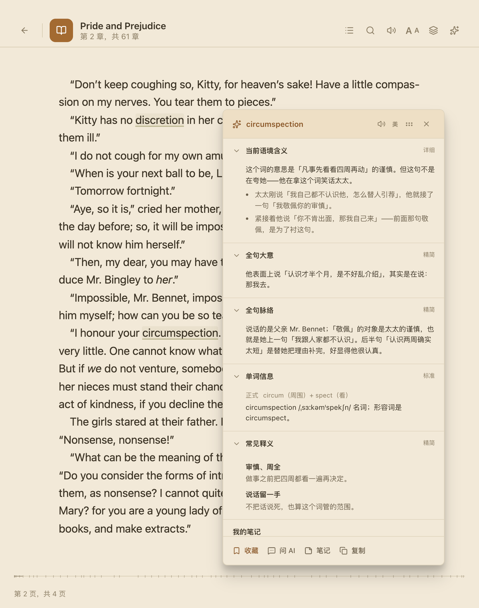
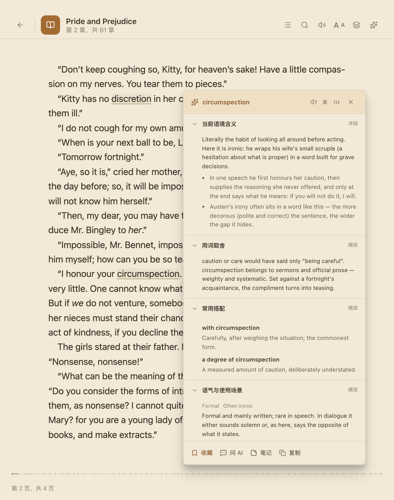
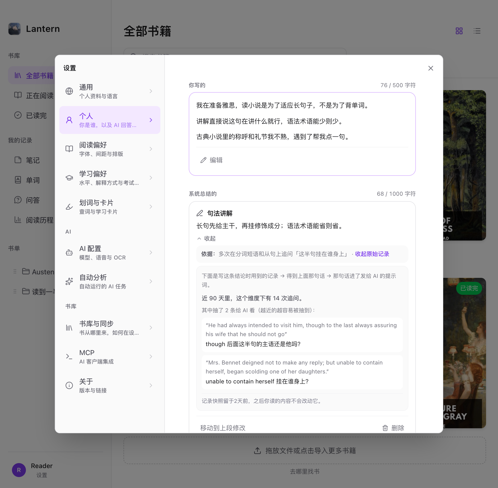
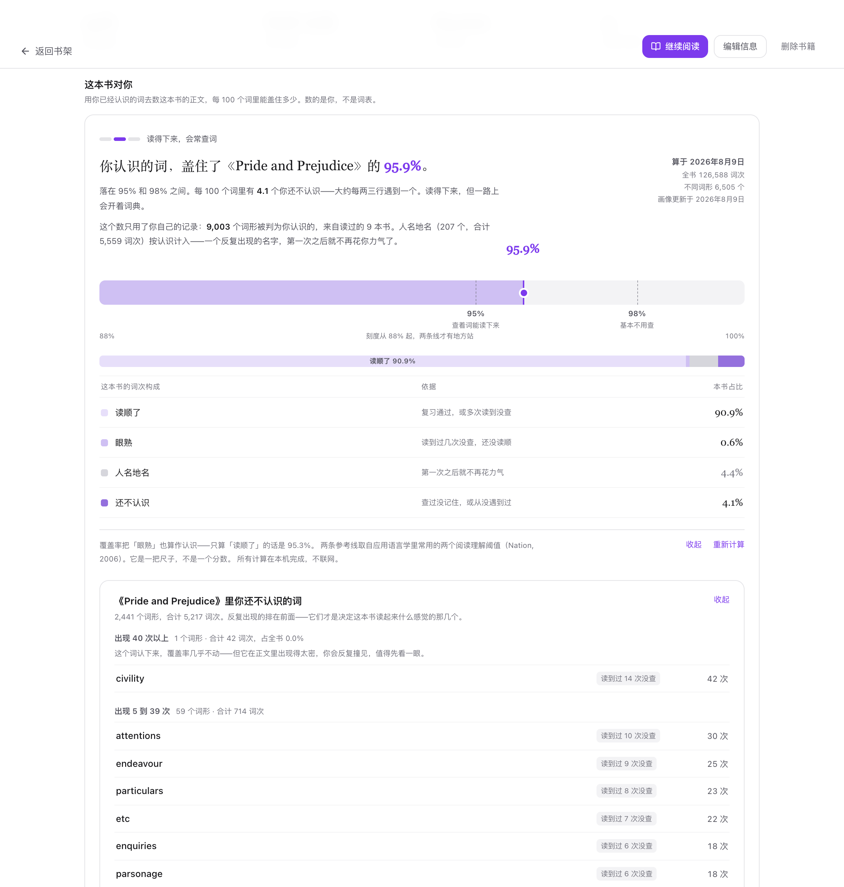

<div align="center">


# Lantern

**把 AI 放进书里，而不是把书搬进聊天窗口。**

[](https://github.com/KlaraGraff/lantern/releases)
[](#支持的平台)
[](LICENSE)

[简体中文](README.md) · [English](README.en.md) · [下载](https://github.com/KlaraGraff/lantern/releases)

</div>


---

## 你早就在用 AI 读书了，只是方式很别扭

读到看不懂的一段，复制，切窗口，粘进聊天框。它不知道你在读哪本书、读到第几章、这句前后写了什么，也不知道你的英语到什么程度，于是按母语者的口径回答你。切回来还得重找位置——而那个答案是悬空的，想核对原文只能自己翻。

**Lantern 是反过来做的。** macOS / Windows 桌面阅读器，本地优先，用你自己的 AI 服务。那些你懒得每次交代的事，它一开始就知道。

1. **它拿得到上下文**——你的英语水平、读到哪、哪本哪章、选中处前后、以及它从你过去的提问里总结出的「你想要什么样的解释」。
2. **它说的每一句都能点回原文**——不是孤零零的答案，是能带你回到书里那一句的答案。
3. **你读过的，它自己在记**——哪个词你不查了、哪个词又栽了、这本书你认识其中多少词，都从读书本身长出来。
4. **它说什么、怎么说，由你写**——预设模块不合用，自己写提示词造一个。
5. **它甚至可以不是它**——通过 MCP 把书库交给 Claude Code、Codex。

---

## 一 · 它知道的，比一个聊天窗口多得多

聊天窗口只拿到你粘进去的几行。Lantern 每次请求还带着这些，**不需要你交代**：

| 它知道 | 于是 |
| --- | --- |
| 你的英语水平 | 用词和句子复杂度跟着变，而不是永远按母语者口径 |
| 你想要什么样的解释 | 从你过去的查词和追问里总结，你也可以直接写给它 |
| 你读到哪 | 默认不拿你还没读到的地方回答你 |
| 在读哪本哪章 | 认得出人名地名和前情，不用每次说「这是《XX》里的」 |
| 选中处前后 | 先定住这个词在这里的意思，而不是罗列义项让你挑 |
| 整本书 | 答案从书里检索出来，不靠模型对这本书的记忆 |

### 它知道你的水平

多数工具的「英语解释」是个开关：打开就给你接近母语者的英文。对 B1 读者，那段解释本身就是新障碍。Lantern 把水平当作**每次请求的条件**——填 CEFR（A1–C2），或填雅思、托福、托业、剑桥、DET、四六级成绩由应用换算。讲解语言另有一档：中文 / 中英对照 / 全英文。

但「照顾水平」很容易滑向为了简单而牺牲准确。所以有条硬规矩：**解释里非用一个超出你水平的词不可时，保留它并当场就地加注**，用几个更简单的英文词或一个中文括注说清。不许换成更含糊的词，也不许扔在那儿让你另外去查。

另有独立的**讲解风格**开关，管一张卡给几条要点：**详解**多给几条，**简答**只留当场用得上的。

| A2 | C1 |
| --- | --- |
|  |  |

### 它知道你想要什么样的解释

水平说明你能读懂什么，说明不了你想要什么。同样是 B2，有人要词源，有人嫌啰嗦。

所以有一页**用户画像**，AI 回答前先读它。上半段你自己写；下半段是系统从你的查词和追问里总结的卡片，分七个维度（词义、句法、指代、文化背景、查词取向、举例来源、回答节奏）。

- **每张卡都能点开看依据**——凭哪几次记录得出的结论，摊开给你看。
- **冲突时以你写的为准。** 不同意就「移动到上段」改成自己的说法，这一维度从此由你接管。
- **可以整份关掉**，已有内容留着。



### 它知道你读到哪

**默认不会拿你还没读到的地方回答你。** 提前知道后面发生了什么，你本来会自己琢磨出来的东西就没机会出现了。

「阅读思考保护」把回答限制在已读范围内，答案标明「已按你的阅读进度回答（前 X%）」；想要完整答案就点「结合全书重新回答」。可按书单独设，检索范围也由你定：自动 / 选区 / 本章 / 全书。

人物和术语卡同理——**默认只看到你当前读到的位置**，需要整书视角时先说明会包含未读情节再让你确认，且只对这一次生效。


---

## 二 · 它说的每一句，都能点回原文

读一章之前，可以先让它列出这章里你可能不认识的词——清单里**每一条后面都跟着角标，点一下书就翻到那个词所在的那一句**。问剧情也一样：依据一起给出来，每条都能点。

做这件事最好的产品是 NotebookLM，但它的引用只能跳到侧栏里的一段文本——**Lantern 本身就是阅读器，引用跳回的是书里真正的那一页那一句**，落点还会闪一下。

- **引用是内联的。** 正文里带角标，末尾列成一排，两处都能点。答案里的例句同样是链接。
- **按原文找，不按页码猜。** EPUB 拿原文片段在对应章节精确搜索，失败退到备用片段再退到章节开头；PDF 跳页；纯文本按字符偏移。
- **可以跨书。** 引到另一本书的句子，点过去直接打开那本书那一句，顶部留「从《X》的追问跳转到这里 / 回到《X》」。
- **答案是检索出来的**——全书建了全文索引，配了 embedding 再叠一层语义检索。
- **而且受上一节约束。** 引用不会来自你还没读到的地方。

### 用中文名问，也能检索到只写英文名的段落

你问「达西后来怎么了」，书里从头到尾写的是 Darcy——按字面检索一句都找不到。所以建索引时 AI 会顺带认出人物，把译名、简称、外号、「那个牧师」这类叫法归到书里真正的写法上，存成这本书的**人物别名表**（可手动增删、重建）。

一个称呼指向不止一个人时，它不闷头猜：答复上方明说这次按谁理解的，点一下换人，换完这本书就记住了。没认出来也直说——「没认出『某某』是谁，按原文找的」——让你当场指认。

### 隔了几天回来，存下来的东西还挂在书上

聊天记录是越堆越长的流水，生词本是断了句子的孤词。Lantern 里存下来的东西都还连着书：**笔记**（书签也是笔记的一种）、**单词**、**问答**各自按书归类、可搜，每条旁边都有「跳回原文」，落回的是当时那一句。生词卡上留着原文和它**在那一句里**的意思。页边笔记面板把笔记放在它引用的段落旁边；书打开的同时**那段对话也回到侧栏**，角标依然是活的。

**留痕不用你动手。** 查过的词、AI 引用过的段落会自动在正文上留一个轻标记；读熟了的词，标记会自己淡掉——注意力该撤走的地方就撤走（也可以设成永远同一深度）。

选中一段点「解读」，**结果自动缓存**：下次在同一本书选中同一段立刻出结果，不再花一次调用。觉得值得留着再按保存，它才进入问答记录——缓存是省钱的，列表是你挑的。


---

## 三 · 你读过的，它自己在记

读书这件事里，你不问的时间远比你问的时间多。多数背单词工具把这段时间变成任务：推送、红点、连续天数。Lantern 定死了三条相反的规矩——**不推送、不弹窗、不在应用图标上挂角标**，入口旁边最多一个**灰色数字**。灰数字是信息，红点是催促。**复习永远是你自己走进去的。**

### 掌握度不是你打的卡，是你读出来的

一个词出现在你读过的那一屏上而你没查——这就是你认识它的证据。够了就自动升一档：**新词 → 学习中 → 眼熟 → 读顺了**。反过来，升上去的词你又查了一次就退一档。**「以为会了、结果又查了」不是失败，是比任何测验都真实的信号。** 同章内的重复递减计入，但不清零。

每个词都能翻出**「它是怎么走到这一步的」**：哪一天、在哪本书、跨了几天读到几次没查、哪次复习评成了什么。不同意的话，卡上永远有一个「**我其实不认识**」。掌握度按**词**保存，跨书共用。


### 复习页给你的不是队列，是几堆有来由的词

每一堆都写着它为什么成堆：**你在《X》里反复查的词**、**以为会了结果又查了**、**刚读完那一章里你查过这些**、**很久没再遇到的词**。

练的时候原句不会被丢掉：把生词从原句里挖空，先给读音，再给你已保存的中文句意，最后才揭开答案。间隔安排走官方 FSRS 库。

### 这本书对你难不难，本地就算得出来

「这本书是 B2 级」是出版社封底干的事。Lantern 拆成两个问题，**都在本机算，不联网、不消耗 AI 额度**：

**这本书本身有多重**——导入时把全文映射到一张五万词的词频表上，得到频段分布。这跟谁读无关。

**你认识其中多少**——拿你已经认识的词去数正文。结论不是一个孤立的百分数，而是放在一把尺子上：两条参考线（95% 和 98%）取自应用语言学常用的阅读理解阈值（Nation, 2006），落在哪一段对应「现在读查词会很密 / 读得下来会常查词 / 可以自己读下去」。展开还能看到词次构成和**「哪些词认下来提升最大」**。

三条边界：**记录不够就给区间并列出依据**，横跨参考线时宁可说分不出来；**永远不会自己改动你的水平设置**；**书太短或格式取不出正文就直说不下结论**。

第一次打开一本书前，这些汇成一张**开书卡**：词汇构成、最吃力的一段在哪几章、按你最近的速度大约要读多久，**只出现这一次**。扫描件在这里直接给出「下载并识别」——本机识别、不上传，且可以先读起来。



### 会自动花钱的事，全在一屏里

有几件事会在你不操作时自己调用 AI，用你自己的额度——这类最容易变成看不见的账单，所以全部收进**「自动分析」一个页面**：每项写清做什么、什么时候触发、会发送哪些数据，旁边是近 30 天的次数与 token 用量。**用量取服务商返回的确切数字，不折算成钱**（缓存命中、阶梯计价只有服务商算得准）。全部关掉也不影响使用，每项在各自页面留着手动按钮；失败也不静默，会留下一张待生成的卡片。

阅读统计同理——**阅读历程 / 阅读日历 / 学习**三个视角，不设排行、连续天数或惩罚；AI 回顾只负责叙述，**事实先由本地确定性计算，AI 不能重算，更不能补出不存在的数据**，也不发正文、高亮原文和未读内容。

---

## 四 · 预设模块只是起点

内置模块单词卡 11 个、短语卡 8 个、段落卡 9 个（语境含义、常见义项、搭配、词根词缀、语法角色、近义词、记忆提示、原句出处等），每个都能单独开关、排序、设默认展开和内容密度。

**但预设不该限定你的学习方法。** 不够用就自己造：起个名字，写**完全属于你自己的提示词**（最长 2000 字），基于当前选区、上下文和书籍信息生成，然后加进卡片，和内置模块一起显示、排序。每种卡片最多 8 个自定义模块，另可建 6 个自定义选区操作。

于是你可以做出读老书时的**「现在还这么说吗」**（这个词今天还常用吗，日常和考试作文里通常换成什么说法）、用于文学的**修辞与叙事视角**、用于专业书的**术语与前置知识**，或者只保留最少信息的**极简查词**。


---

## 五 · 换成你自己的 AI，也行

Lantern 内置一个 **MCP 服务器**。打开它，Claude Code、Codex 就能直接读你的阅读数据——**不用复制粘贴任何东西**：书目、书单、元数据与索引状态；你的 CEFR 等级和雅思托福成绩（**和内置 AI 用的是同一份**）；生词本、掌握状态、统计、查询历史；高亮、书签、笔记、书内对话、全书与章节摘要。

一共 29 个工具：12 个只读查询、一个「在阅读器中打开」、16 个写入。默认只读；**写权限是一个单独的开关，默认关着**——把数据交出去和把控制权交出去是两回事。删数据或覆盖式导入还会单独确认。

于是你可以在终端里问：「按我的英语水平，从我书库里挑三本能读下去的」。它读的是你真实的阅读记录。

---

## 六 · 每一处都能改，而默认值已经替你想过

**Lantern 里几乎没有写死的地方。** 但「什么都能调」如果意味着「你得先调完才能用」，那只是把活推给了你。三个例子：

**默认值会告诉你代价。** 标记样式里加粗和换字体默认关闭——它们会改变文字宽度，分页模式下一个标记就让这一页重新排版。颜色、下划线不会移动任何文字。

**默认值会拦你一下。** 应用自己也在正文上画东西：朗读位置是冷蓝洗色，生词 / 学习中 / 读顺了是三档下划线——那是一条「注意力逐步撤走」的渐变。你挑的颜色太接近时，设置里会当场提示并指出撞的是哪一个。这个判断是把两个颜色**在真实纸底上混合之后**再算色距，不是比 HEX。

**默认值管的是「词」，不是「字符」。** 查了 `run`，后面的 `ran` / `running` 按字符一个都标不上。所以「标记单词时」有三档：仅当前位置 / 全书相同拼写 / **同单词各词形**。词形点一下让 AI 生成，也可批量补全。

排版同理，且**默认跟着出版方意图走**：中西文字体分开设置，不互相将就；首行缩进与段间距互斥——开了缩进，段间距一律压平（引文块和空段落除外）。全局默认之外，一本书可以保留自己的例外。

---

## 三分钟上手

1. **下载安装** —— 从 [Releases](https://github.com/KlaraGraff/lantern/releases) 取对应平台的安装包。
2. **填一个 AI 服务** —— 「设置 → AI 配置」，填 OpenAI 兼容 API、Anthropic、Ollama 或自建网关。密钥只存在这台设备上。
3. **拖一本书进来** —— EPUB / PDF / TXT 拖进书库，打开，**双击任意一个单词**。

想更贴合自己：「设置 → 学习偏好」填英语等级和讲解语言，「设置 → 个人」写两句你想让 AI 先知道的事，「设置 → 划词与卡片」调你想看的模块。

---

## 完整功能

<table>
<tr><td width="130"><b>AI 理解</b></td><td>语境查词 · 短语释义 · 段落解读 · 整段翻译 · 书内持续对话 · <b>每条回答带可点击的原文引用，例句也是链接</b> · 引用可跨书跳转并原路返回 · 全文索引 + 可选语义检索 · 回答范围可选自动 / 选区 / 本章 / 全书 · <b>阅读思考保护</b>，可一键改为结合全书 · <b>人物别名表</b>，指代不清时明说按谁理解并可当场换人 · 人物 / 术语轻卡 · 明确展示本次带进对话的原文 · 问答按书归档可搜索；解读自动缓存</td></tr>
<tr><td><b>它认识你</b></td><td><b>用户画像</b>：上半段你写，下半段系统总结成七个维度的卡片，每张可展开看依据、可改写接管、冲突时以你写的为准、可整份关闭 · 学习者等级（CEFR，或由雅思 / 托福 / 托业 / 剑桥 / DET / 四六级换算）· 讲解语言：中文 / 中英对照 / 全英文 · <b>讲解风格：详解 / 简答</b></td></tr>
<tr><td><b>学习闭环</b></td><td>生词本 · 查询历史 · <b>四档掌握度（新词 / 学习中 / 眼熟 / 读顺了），读到不查自动升、又查一次自动退</b> · 每个词可查「它是怎么走到这一步的」，随时按「我其实不认识」拨回 · 按词保存、跨书共用 · 生词卡可整张重新生成，可展开收藏时的完整卡片 · <b>复习页按来由分堆</b>，不是算法队列 · 官方 FSRS · 原句挖空、逐层提示 · 章末一行小字提示 · 笔记中心与页边笔记面板 · CSV / JSON 词汇导入导出 · 导出 Markdown / CSV / Anki CSV</td></tr>
<tr><td><b>这本书对你</b></td><td>导入时本机统计全书词频，映射到五万词表的各频段 · <b>覆盖率落在 95% / 98% 两条阅读理解参考线（Nation, 2006）构成的尺子上</b> · 可展开词次构成与「哪些词认下来提升最大」· 记录不足时给区间并列依据 · 可选是否把「眼熟」算作认识、是否在书架卡片显示 · <b>开书卡</b>只在首次打开时出现 · 水平对照排除本书题材词汇 · <b>不联网、不消耗 AI 额度、永不自动改动你的水平设置</b></td></tr>
<tr><td><b>正文标记</b></td><td><b>查过的词与 AI 引用过的段落自动留痕</b>，读熟后自行淡出（可关）· 三档匹配范围：当前位置 / 全书同词 / <b>同词各词形</b>（AI 生成或批量补全，可手改）· 已保存生词可显示词上小字或页边释义 · 手动高亮 · 手动与自动两套独立样式 · 选色撞上系统标记时当场警告 · 不改动原书内容</td></tr>
<tr><td><b>阅读体验</b></td><td>暖色纸感主题与自定义背景色 · 深色跟应用内选的那一档，不问操作系统 · <b>中西文字体分开设置</b> · 自定义字体导入 · 字号、行距、字间距、页边距、两端对齐、语言断词 · <b>首行缩进与段间距互斥</b> · 全局默认与本书单独设置 · 滚动 / 分页 · 目录侧栏 · 页边笔记面板 · 多窗口层叠 · 书单管理书库 · 导入时读取 EPUB 自带书名与作者</td></tr>
<tr><td><b>朗读</b></td><td>四种音源：词典真人录音 / 系统语音 / Edge 神经语音 / 自定义 OpenAI 兼容 TTS · 按内容长短和语言自动选源 · 连续朗读播放器 · 自动跨段翻页 · 逐句跟随高亮 · 暂停后续读</td></tr>
<tr><td><b>阅读回顾</b></td><td>阅读历程 / 阅读日历 / 学习 三视图 · 按范围和书籍筛选 · 5 分钟闲置暂停、30 秒以下丢弃 · 本地可复算 · 可选 AI 回顾只叙述结构化事实</td></tr>
<tr><td><b>额度与自动化</b></td><td><b>一个页面列出所有会在你不操作时调用 AI 的任务</b>，每项写明触发时机、发送数据、近 30 天次数与 token · 顶部汇总与「全部关闭」· 用量取服务商确切数字，不折算成钱 · 关闭后仍保留手动按钮 · 失败留下待生成卡片</td></tr>
<tr><td><b>AI 服务与索引</b></td><td>OpenAI 兼容 API · Anthropic · Ollama · 可选 OpenAI OAuth · 多服务优先级 · 每服务多个 Key，输出前自动试 · 连接测试与模型发现 · <b>为整个书库批量建索引</b>，可停可续 · 单本索引分切分块 / 定位句 / 生成向量 / 章节摘要 / 人物姓名五阶段，失败可断点重试</td></tr>
<tr><td><b>集成与工具</b></td><td>MCP 服务器，写权限独立开关且默认关闭 · 扫描版 PDF 的 OCR，可边识别边读 · 可编辑的书籍来源站点列表 · 书籍元数据编辑 · 应用内检查并安装更新</td></tr>
</table>

---

## 支持的平台

| 平台 | 支持范围 |
| --- | --- |
| **macOS** | macOS 12 或更高，**仅 Apple Silicon**。主要平台，功能最全。 |
| **Windows** | Windows 11 x64。可本地阅读并使用全部 AI 功能，**不含 iCloud 文件夹同步**。 |
| Intel Mac · Linux | 当前不提供安装包。 |
| iOS | 开发中，尚未发布。见 [路线图](docs/roadmap/mobile-ios.md)。 |

## 支持的格式

| 格式 | 导入方式 | 阅读控制 | 选择与手动高亮 | 自动词汇标记 |
| --- | --- | --- | --- | --- |
| **EPUB** | 原生阅读 | 字体、行距、页边距、滚动 / 分页 | ✅ | ✅ |
| **TXT · Markdown · HTML** | 保留原文件，转为内部 EPUB | 同 EPUB | ✅ | ✅ |
| **PDF** | 原生阅读 | 主题、缩放、单 / 双页、滚动 / 分页 | 有文本层时 ✅ | ❌ |
| **MOBI · AZW · AZW3 · FB2 · FBZ** | Foliate 原生解析器 | 渲染器支持时可用 | ❌ | ❌ |
| **CBZ** | 原生阅读 | 仅主题 | ❌ | ❌ |

不支持 DRM，也不保证完美渲染每一种出版商特定的文件变体。

---

## 你的数据在哪

- **本地优先。** 书、进度、生词本、笔记、用户画像和统计都存在这台设备上。
- **API Key 与 OAuth 令牌只保存在本机的凭据数据库里**，不返回界面层，也不参与同步。
- **需要多设备同步时**，在设置里选一个你自己 iCloud Drive 里的文件夹，每台 Mac 选同一个。
- **AI 请求默认只发送当前任务所需的上下文**，不自动上传整本书。会自动调用 AI 的功能全部集中在「设置 → 自动分析」，逐项写明发送范围，可单独或全部关闭。
- **词频统计、覆盖率与 OCR 全部在本机进行**，不联网。

## 下载

安装包和发行说明见 [Releases](https://github.com/KlaraGraff/lantern/releases)。macOS 安装包的签名状态以最新一次发行说明为准，进展见 [macOS 分发](docs/guide/macos-distribution.md)。

## 开发

要求：Node.js 22、npm、Rust，以及目标平台的 Tauri 前置依赖。阅读器引擎（foliate-js）源码已随仓库提交。

```bash
git clone https://github.com/KlaraGraff/lantern.git
cd lantern
npm ci
npm run tauri dev
```

```bash
npm exec tsc --noEmit && npm run lint && (cd src-tauri && cargo check)
```

技术栈：Tauri 2 + Rust + SQLite，React 19 + TypeScript + Tailwind 4，foliate-js。协作约定见 [AGENTS.md](AGENTS.md)。

## 致谢与许可证

Lantern 基于 yicheng47 开发的 [Quill](https://github.com/yicheng47/quill)，是独立维护的个人版本，并非原项目的官方发行版。原版 Quill 的版权仍归其作者所有；本仓库保留原始 [MIT License](LICENSE)，包括其中的版权声明。
