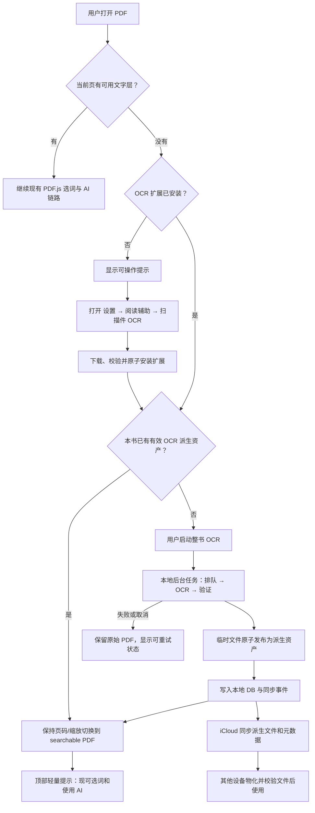

# 扫描 PDF OCR、可选文字与跨设备派生资产升级方案

> 状态：外部可行性评审稿；同步路径契约前置修复已完成，OCR 主功能尚未进入实现
>
> 更新日期：2026-07-18
>
> 适用项目：Lantern
>
> 许可前提：Lantern 核心代码继续采用 MIT 许可证并保持开源
>
> 关联现有计划：[格式规整管线](../impls/format-normalization-pipeline.md)

## 0. 文档用途与阅读约定

本文完整记录扫描版 PDF 升级讨论的背景、已经对齐的产品决定、推荐技术架构、与现有 Lantern 代码的衔接点、派生资产同步设计、备选路线、风险、工程量、验证计划和仍需 PoC 回答的问题。

本文将交给另一位 AI 或工程师进行独立审查。评审者应重点判断：

1. OCRmyPDF/Tesseract 是否适合作为 Lantern 的可选本地 OCR 后端。
2. 能否在普通 PDF 输出模式下确认排除 Ghostscript，并继续裁掉其他非必要依赖。
3. 推荐的派生资产模型是否符合 Lantern 当前 iCloud 事件日志同步架构。
4. 下载、卸载、失败恢复、跨设备切换和旧客户端兼容是否存在遗漏。
5. 是否有更小、更稳定、许可证更简单的开源实现路线。
6. 本文对工作量、包体、性能和稳定性的估计是否合理。

文中使用以下标签区分确定性：

- **已确认**：产品讨论已经明确决定。
- **推荐**：当前首选设计，可以由评审提出更优方案。
- **估算**：尚未通过 Lantern 实际构建或样本基准测试验证。
- **PoC 必验**：不得直接当作实现事实，必须先做小型原型验证。

这是一份评审稿，不是正式 GitHub feature spec；本轮不创建 GitHub issue、不分配优先级，也不修改现有 feature 索引。若方案通过评审，再按仓库 `feature` 流程建立 issue、编号规格和实施计划。

## 1. 执行摘要

### 1.1 推荐结论

扫描 PDF 的首选路线是：

1. Lantern 主安装包不内置完整 OCR 环境。
2. 用户按需下载、更新或卸载独立的本地 OCR 扩展。
3. 默认扩展带英文和简体中文快速模型；高精度模型单独下载和卸载。
4. 后台一次性把扫描 PDF 生成带标准隐藏文字层的 `searchable PDF`。
5. 原始 PDF 永久保留；OCR 结果作为同一本书的派生阅读资产。
6. 完整派生资产参与 iCloud 同步，其他设备不必重复 OCR。
7. PDF.js/Foliate 继续使用标准文字层完成选词、选句、高亮和 AI 查询。
8. 不向用户暴露并发数；后端按 CPU、内存和压力自动调度。
9. Tesseract.js 实时透明文字覆盖层不作为主路线。
10. PDF → 可重排 EPUB 是独立的后续实验能力，不与“给 PDF 增加文字层”混为一件事。

### 1.2 为什么优先生成 searchable PDF

Lantern 已经支持带文字层 PDF 的浏览器原生选择。扫描件当前失败的根因不是 AI 功能缺失，而是页面只有图像、没有可提取文本。把 OCR 文本准确写回 PDF 后，现有选择与 AI 链路可以继续工作，改动集中在安装管理、后台任务、资产发布和同步，不需要重写 PDF 选区系统。

相较之下，实时 Tesseract.js 覆盖层必须自行处理缩放、旋转、双页、滚动虚拟化、跨行选择、中文断句、高亮锚点和 OCR 版本变化，长期稳定性风险明显更高。

### 1.3 主要发布门槛

以下条件全部完成前，不应把功能标记为可发布：

- 可选 OCR 扩展具备校验、原子安装、卸载、更新和签名方案。
- OCR 输出在代表性扫描书上能被当前 PDF.js 正常选择和复制。
- 转换任务崩溃安全、可恢复，不覆盖或损坏源文件。
- 已完成的 `source_file_path`/`file_path` 同步路径契约修复继续通过 event、snapshot 和双设备 replay 回归测试。
- 派生资产同步协议完成，包括 iCloud 占位文件、哈希验证和远端回退。
- 旧客户端遇到新同步事件时不会阻塞整个 peer 日志。
- macOS 11 Apple Silicon 与 Windows 11 x64 均通过真实打包验证。
- OCR 扩展中所有第三方组件均有明确许可证清单和对应义务。

## 2. 产品与技术背景

### 2.1 用户问题

常见电子书实际是逐页扫描图像封装成的 PDF。这类文件能显示页面，却没有字符、词、句或段落信息，因此用户无法：

- 单击或双击单词查词；
- 拖选句子或段落；
- 复制正文；
- 使用 Lantern 的 AI 解释、翻译、追问；
- 基于文本建立高亮、词汇标记或可检索索引。

用户最初同时询问了两类方案：

1. 把扫描 PDF 高质量转换为 EPUB。
2. 不转换格式，只让扫描 PDF 支持选词、选句和现有 AI 功能。

调研结论是，没有一个成熟开源工具能对任意扫描书稳定完成“图像 → OCR → 语义段落/章节 → 高质量可重排 EPUB”。单栏小说可能得到可用结果，但双栏、脚注、表格、插图、页眉页脚和复杂阅读顺序仍需人工校对。相反，给原 PDF 增加隐藏 OCR 文字层已有成熟工具链，且更符合 Lantern 当前架构。

### 2.2 Lantern 当前 PDF 能力

当前 README 已说明：PDF 具备可用文字层时，支持选择和手动高亮；扫描件不支持。阅读器现有实现包括：

- PDF 由 Foliate/PDF.js 渲染。
- 阅读器通过 PDF.js 生成的 `.textLayer` 获取浏览器 Selection。
- 选区进入统一的 `ReaderInteraction`，再复用查词、解释、翻译、复制、高亮和 Ask AI。
- 当前页没有文字层时，阅读器监听点击和右键并显示五秒提示。
- Reader 已有通用轻量 `Toast`，可以复用为 OCR 完成通知。

相关位置：

- [PDF 无文字层交互检测](../../src/pages/reader/useReaderInteractions.ts)
- [Reader 中的 PDF 提示和 Toast](../../src/pages/Reader.tsx)
- [PDF 阅读能力矩阵](../../src/components/reader-settings.ts)
- [中英文当前提示文案](../../src/i18n/zh.json)

现有无文字层判断的大意是：页面 canvas 已渲染、`.textLayer` 已完成，但文字层内容为空。它是一个可复用接入点，但仍属于“当前页、交互后判断”，不是稳定的整书扫描分类器。

### 2.3 Lantern 当前格式规整管线

仓库已经存在一个可复用的后台转换骨架：

- `source_format`、`render_format`、`source_file_path`、`source_sha256` 和 `conversion_version` 已进入 `books` 数据模型。
- `pending → preparing → ready/failed` 状态机已实现。
- 任务使用源文件快照和 guarded update 防止陈旧任务覆盖新状态。
- 输出先写临时 sidecar，再原子重命名，避免把半成品标记为 ready。
- 应用启动可恢复中断任务。
- 当前 MOBI/AZW/AZW3 后端使用 Calibre `ebook-convert`。
- 代码注释已经明确预留“scanned PDF later”。

相关位置：

- [转换状态机和 Converter seam](../../src-tauri/src/commands/books/convert_prepare.rs)
- [书籍路径解析和本地产物重定向](../../src-tauri/src/commands/books/query.rs)
- [书籍数据结构](../../src-tauri/src/commands/books/mod.rs)
- [格式规整管线现有计划](../impls/format-normalization-pipeline.md)

但当前管线有一个与新要求直接冲突的既定假设：转换 EPUB 存在 `local_data_dir()/prepared/`，明确不进入 iCloud；远端设备收到书籍后自行重新转换。新方案要求 OCR 派生文件同步，以便手机或其他设备直接使用，所以不能只向现有 `Converter` 增加 OCR 命令，还必须改变派生资产和同步模型。

### 2.4 Lantern 当前同步模型

Lantern 是 local-first：

- SQLite 是当前设备的物化视图，始终保留本地，不直接放入 iCloud。
- 每台设备写自己的 JSONL 事件日志。
- iCloud 同步事件日志和书籍/封面二进制文件。
- 其他设备重放 peer 事件构建本地数据库。
- iCloud 可能把大文件替换为 `.icloud` 占位文件；使用前需要触发物化。

相关位置：

- [架构概览](../arch/overview.md)
- [同步事件定义](../../src-tauri/src/sync/events.rs)
- [同步 merge](../../src-tauri/src/sync/merge.rs)
- [同步 writer 和事务不变量](../../src-tauri/src/sync/writer.rs)
- [iCloud 占位文件 replay 行为](../../src-tauri/src/sync/replay.rs)

任何新资产方案都必须保持现有安全不变量：没有可用、完整、可验证的本地文件时，不得把阅读指针切到新文件，也不得使源文件失去可达性。

### 2.5 已发现并完成修复的同步前置问题

源码复核发现，当前 PDF/EPUB 等原生书籍导入和同步验证存在路径契约不一致：

- PDF 导入把 `source_file_path` 设置为和 `file_path` 相同的 `books/...`。
- `BookImport` 事件验证对 `file_path` 调用 `validate_book_path()`，允许 `books/...`。
- 同一事件中的 `source_file_path` 却调用 `validate_source_path()`，只允许 `sources/...`。
- replay 在一个 peer log 中发现任何无效事件时，会拒绝该 peer 的整份日志。
- snapshot 验证当前只验证 `file_path`，没有对 `source_file_path` 应用等价检查。

相关位置：

- [PDF 导入路径](../../src-tauri/src/commands/books/import.rs)
- [事件路径验证](../../src-tauri/src/sync/validation.rs)
- [peer log 整体拒绝](../../src-tauri/src/sync/replay.rs)
- [snapshot 验证](../../src-tauri/src/sync/snapshot/apply.rs)

这会让合法的原生书籍导入事件报 `SYNC_BLOB_PATH_INVALID`。该前置问题已由提交 `75139ff` 修复：`file_path` 与 `source_file_path` 现在统一按书籍文件角色接受经过白名单验证的 `books/...` 或 `sources/...`，event 与 snapshot 使用同一验证规则，并新增真实导入形态的 replay/snapshot 回归测试。该问题独立于 OCR，但其修复是新资产同步可信基线的一部分；后续改动不得破坏这些回归测试。

## 3. 术语

- **扫描 PDF**：页面主要由扫描图像组成，当前页没有足够的可提取文字。
- **文字层 PDF / searchable PDF**：视觉页面仍是原图，同时包含位置对齐的不可见文字，可搜索、复制和选择。
- **OCR 扩展**：按需下载的本地执行环境、包装器和默认语言模型，不属于主安装包。
- **快速模型**：Tesseract `tessdata_fast` 中的语言数据。
- **高精度模型**：Tesseract `tessdata_best` 中的语言数据。
- **源资产**：用户导入且必须永久保留的原始 PDF。
- **派生资产**：由源资产生成的 searchable PDF 或未来的 reflow EPUB。
- **活动阅读资产**：当前设备打开此书时实际交给阅读器的文件。
- **本地任务状态**：排队、转换中、失败等设备临时状态，不等同于已同步资产。
- **发布**：派生文件完成、验证、落盘并写入同步元数据后，才允许其他设备发现它。

## 4. 已确认的产品决定

| 主题 | 已确认决定 |
|---|---|
| 开源与许可 | Lantern 始终保持开源，核心代码继续采用 MIT |
| 主包体积 | OCR 不直接进入主包，作为可选扩展按需下载 |
| 扩展管理 | 设置中可以下载、更新和卸载 OCR 组件 |
| 默认语言 | 第一阶段默认提供 `chi_sim + eng` |
| 默认质量 | 快速模型随基础 OCR 组件提供 |
| 高精度 | 高精度模型单独下载、选择和卸载 |
| 并发设置 | 不向用户显示并发数，后端按设备能力自动决定 |
| 未安装交互 | 扫描页上点击、双击、拖选、右键等文字交互触发可操作提示 |
| 深链接 | 提示按钮直接打开设置并定位到 OCR 下载位置 |
| 转换中交互 | 清楚显示“转换中”，避免重复排队；用户仍可阅读原始页面 |
| 完成反馈 | 转换完成后，阅读器顶部显示轻量提示 |
| 原始文件 | 始终保留，不原地覆盖 |
| 同步 | OCR 派生资产需要同步，其他设备无需重复转换 |
| 卸载行为 | 卸载 OCR 扩展或模型不删除已经生成的阅读资产 |
| 主要技术方向 | 优先生成标准 searchable PDF，复用现有 PDF.js 文字层 |
| 实时覆盖层 | Tesseract.js + 自建实时选区覆盖层不作为首选主路线 |

## 5. 目标与非目标

### 5.1 第一阶段目标

- 用户无需预装 Homebrew、Python、Tesseract 或 Ghostscript。
- 在设置中可看见 OCR 扩展和模型的准确状态、大小、版本及操作。
- 扫描页文字交互能够引导用户安装或启动 OCR。
- OCR 完全在本地运行，不上传书籍页面。
- 转换过程不阻塞阅读器，不覆盖源文件，可取消、可恢复、可重试。
- 输出标准 searchable PDF，并由当前 PDF.js 选择层驱动既有 AI 功能。
- 派生资产经 iCloud 同步到其他设备。
- 未安装扩展、网络中断、空间不足、OCR 失败、iCloud 文件未物化时都能优雅降级到原始 PDF。
- 保持当前 macOS 11 Apple Silicon 和 Windows 11 x64 产品系统要求。

### 5.2 第一阶段非目标

- 对任意复杂扫描书生成语义完美、可重排的 EPUB。
- 云端 OCR 或调用当前 AI provider 识别整本书。
- 首次导入扫描 PDF 后未经用户授权自动下载组件或启动大量计算。
- 覆盖全部 Tesseract 语言；第一阶段只承诺简体中文和英文。
- 自动修复 OCR 错别字、章节结构、表格或公式。
- 在 PDF 和 EPUB 两种坐标空间之间自动映射所有历史高亮。
- 在本功能中实现完整手机客户端；这里只保证派生资产模型可供未来手机端消费。
- 自动把现有 MOBI/AZW 转换 EPUB 的本地产物全部迁移为同步资产；该扩展范围需单独确认。

## 6. 总体架构



### 6.1 组件边界

推荐拆分为以下职责：

1. **OcrPackageManager**
   - 拉取可信 manifest；
   - 下载、校验、安装、更新和卸载引擎/模型；
   - 返回组件版本、路径、许可和可用性。

2. **OcrBackend**
   - 探测执行环境；
   - 根据源文件、语言、质量和 jobs 执行 OCR；
   - 提供取消和结构化进度；
   - 不直接修改数据库或同步状态。

3. **OcrJobManager**
   - 单一全局队列；
   - 持久化任务状态；
   - 源快照防陈旧发布；
   - 崩溃恢复、取消和重试。

4. **BookAssetPublisher**
   - 验证输出；
   - 计算哈希和大小；
   - 原子发布到同步数据目录；
   - 在同一逻辑操作中写资产元数据和 sync outbox。

5. **Reader OCR Controller**
   - 判断当前页是否缺文字；
   - 根据扩展/任务/资产状态显示相应 UI；
   - 完成后保持阅读位置切换资产。

6. **Settings OCR View**
   - 展示引擎、模型、空间和下载状态；
   - 处理下载、卸载、高精度选择和错误。

## 7. 输出格式策略

| 路线 | 第一阶段定位 | 优点 | 主要问题 |
|---|---|---|---|
| 原 PDF + 隐藏文字层 | **推荐主路线** | 保留原版布局；PDF.js 原生选择；页码稳定；AI 链路复用 | 文件接近再存一份；OCR 阅读顺序仍可能出错 |
| 扫描 PDF → reflow EPUB | 后续实验 | 手机小屏重排更舒适；EPUB AI 功能完整 | 段落/章节/双栏/脚注重建不可靠；PDF 与 EPUB 坐标不兼容 |
| Tesseract.js 实时覆盖层 | 不推荐主路线 | 不生成第二份 PDF；可只识别当前页 | 自建选择层和稳定锚点复杂，运行时 CPU/内存高 |
| 云端多模态 AI → EPUB | 不属于本方案 | 可能改善结构理解 | 成本、隐私、网络、可重复性和 provider 依赖明显 |

### 7.1 searchable PDF 的预期性质

- 视觉页面尽量保持原图，不重新排版。
- OCR 文本不可见但具备准确坐标和复制映射。
- 页数原则上与源文件一致。
- 输出不是“缓存截图”，而是可独立阅读、同步和备份的派生书籍资产。
- 文字层质量影响选词内容，但不影响原始页面视觉可读性。

### 7.2 EPUB 的后续边界

如果后续增加 OCR → EPUB：

- 应作为另一种派生资产，不替换或删除 searchable PDF/源 PDF。
- 必须明确标为“实验性重排”，不能承诺版式保真。
- 所有设备若要共享同一套 EPUB CFI、高亮和进度，应统一使用同一个 EPUB 资产。
- 桌面使用 PDF、手机使用 EPUB 时，不能假设页码/CFI/文字范围可以直接互换；需要按资产存储位置状态，或实现单独的映射层。

## 8. OCR 后端候选与最小命令

### 8.1 首选候选：OCRmyPDF + Tesseract

[OCRmyPDF](https://github.com/ocrmypdf/OCRmyPDF) 是成熟的本地扫描 PDF OCR 管线：

- 使用 Tesseract 识别 100 多种语言；
- 把 OCR 文字准确放到原图下方；
- 支持跳过已有文字页、旋转和纠偏；
- 输出 searchable PDF；
- 支持 macOS、Windows 和 Linux；
- OCRmyPDF 自身采用 MPL-2.0。

候选命令仅用于 PoC，最终参数必须固定到已验证版本：

```text
ocrmypdf
  --mode skip
  --output-type pdf
  --rasterizer pypdfium
  --optimize 0
  --fast-web-view 999999
  --jobs <auto_jobs>
  -l chi_sim+eng
  <source.pdf>
  <temporary-output.pdf>
```

候选参数意图：

- `--mode skip`：混合 PDF 中跳过已有文字页，仅 OCR 扫描页。
- `--output-type pdf`：不要默认 PDF/A，以减少结构变化和 Ghostscript 路径。
- `--rasterizer pypdfium`：优先 PDFium 而不是 Ghostscript。
- `--optimize 0`：第一阶段避免无关图像重编码和质量变化，也有机会裁减依赖。
- `--fast-web-view 999999`：避免额外线性化步骤。
- `--jobs`：由 Lantern 自动计算。
- `-l chi_sim+eng`：第一阶段默认语言。

首版推荐默认不启用 `--deskew`、`--clean`、`--remove-background` 或 `--force-ocr`。这些预处理可能让页面重新栅格化、改变可见图像，`--force-ocr` 还会破坏已有原生文字、表单和结构。`--rotate-pages` 可以进入 PoC，但它需要额外约 10.07 MiB 的 `osd.traineddata`，只有在旋转样本收益明确时才默认安装。首版不暴露大量 OCR 专业参数。

### 8.2 Ghostscript-free 最小包

OCRmyPDF v17 已把 Ghostscript降为可选依赖：

- PDFium 已是优先 rasterizer；
- Ghostscript主要用于 PDF/A 转换和兼容性回退；
- 普通 PDF 输出不需要 PDF/A/veraPDF；
- `jbig2enc`、`pngquant`、`unpaper` 也不是首版必要组件。

首版推荐明确不分发、不调用 Ghostscript，固定普通 PDF、PDFium rasterizer并关闭优化。但仍需 **PoC 必验**：

- 必须在完全没有 `gs` 的干净环境运行完整样本矩阵；
- 清理 PATH 后确认不会静默发现系统 Ghostscript；
- 必须明确哪些异常 PDF 会失去兼容性回退；
- 输出 SBOM 和每个平台的真实二进制依赖；
- 若最小包不可行，下一优先级是评估现有 PDFium + native Tesseract + PDF grafting，而不是直接转向实时透明覆盖层。

### 8.3 后端抽象

现有 `Converter` seam 值得复用理念，但 OCR 输出并不一定是 EPUB，建议不要硬塞进当前只接受 EPUB destination 的接口。可定义独立接口：

```rust
trait OcrBackend {
    fn probe(&self) -> OcrBackendInfo;
    fn recognize_pdf(
        &self,
        source: &Path,
        destination: &Path,
        options: &OcrOptions,
        progress: &dyn OcrProgressSink,
        cancellation: &CancellationToken,
    ) -> AppResult<OcrReport>;
}
```

后端不得自行：

- 覆盖源文件；
- 更新 `books` 或 `book_assets`；
- 发布同步事件；
- 接受拼接后的 shell 字符串；
- 把用户文件名当作命令选项。

## 9. OCR 扩展与模型管理

### 9.1 设置位置

推荐放在现有“设置 → 阅读辅助”中，增加“扫描件 OCR”子视图，而不是增加一个只偶尔使用的顶层设置项。

阅读器跳转时需要精确打开该子视图。当前 `open-settings` 事件只传 section 字符串，建议扩展为向后兼容的目标：

```ts
type SettingsDestination =
  | SettingsSection
  | { section: "tools"; view: "ocr" };
```

旧字符串 payload 继续有效；新 reader window payload 可以定位 OCR 视图并把焦点放到主要下载按钮。Reader 是独立窗口，CTA 应继续调用主窗口设置命令，由后端同时 `show()`、聚焦主窗口并发送结构化 destination，避免每个调用点各自遗漏聚焦。

### 9.2 设置界面内容

建议显示以下区域：

#### OCR 组件

- 状态：未安装 / 下载中 / 校验中 / 安装中 / 已安装 / 可更新 / 卸载中 / 失败。
- 版本和预计占用空间。
- 操作：下载、重试、更新、卸载。
- 下载进度：已下载字节/总字节；总大小未知时显示不确定进度。
- 错误详情保持简短，允许复制诊断信息。

#### 识别质量

- 快速：默认，安装组件时包含 `chi_sim + eng fast`。
- 高精度：单独显示预计下载大小，支持下载和卸载。
- 如果用户选择高精度但模型尚未安装，先确认下载；不得静默回退后仍把任务标为高精度。
- 卸载当前选择的高精度模型后，未来任务回到快速；既有派生资产不受影响。
- 模型更新不自动重跑整本书，避免高亮锚点和同步文件无提示变化。
- “高精度”是用户可理解的质量模式名，不承诺每类扫描书都一定比 fast 准确；PoC 必须同时比较准确率、耗时和内存。
- fast/best 文件名相同，应放在不同 tessdata 目录，通过任务独立的 `TESSDATA_PREFIX` 选择，不能把两组模型混放。
- 多语言顺序可能影响速度和结果；PoC 应比较 `chi_sim+eng` 与 `eng+chi_sim`，也要验证纯英文书无条件加载中文模型的代价。
- 竖排中文需要额外的 `chi_sim_vert` 等模型，不属于首版中英默认能力。

#### 存储与派生资产

- OCR 派生资产总占用。
- “管理已识别书籍”入口。
- 区分：
  - 仅移除本机下载副本；
  - 从所有设备删除该 OCR 版本。
- 卸载引擎与删除派生书籍必须是两个独立操作。

#### 不显示的内容

- 不显示 jobs/线程数。
- 不在首版展示 page segmentation mode、DPI、去噪等专业参数。
- 不提供“自动上传到云 OCR”。

### 9.3 包 manifest

扩展必须由版本化 manifest 驱动，示意：

```json
{
  "schemaVersion": 1,
  "component": "lantern-ocr-runtime",
  "version": "1.0.0",
  "target": "aarch64-apple-darwin",
  "minimumOsVersion": "<validated-by-poc>",
  "url": "https://.../lantern-ocr-runtime-1.0.0.tar.zst",
  "sha256": "...",
  "compressedBytes": 0,
  "installedBytes": 0,
  "licenses": ["MPL-2.0", "Apache-2.0"],
  "models": ["eng-fast", "chi_sim-fast"]
}
```

manifest 和包应使用 HTTPS、固定可信源、SHA-256 校验；推荐再加发布签名。解包必须拒绝绝对路径、`..`、符号链接逃逸和不在白名单内的可执行文件。

逻辑上拆成三个版本化单元：`ocr-runtime`、`standard-model-pack`、`high-accuracy-model-pack`。用户下载 runtime 时默认一起安装 standard pack；high-accuracy 独立管理。每个目标平台/架构单独发布，避免 universal 包无谓携带两套原生二进制。manifest 还应记录依赖、模型 hash 和 license manifest。

### 9.4 原子安装与卸载

安装流程：

1. 下载到扩展根目录之外的临时文件。
2. 校验大小、SHA-256 和签名。
3. 解包到版本化临时目录。
4. 运行只读 `--version`/自检，确认引擎和语言模型可用。
5. macOS 验证签名/公证要求；Windows 验证签名策略。
6. 原子切换 `current` 指针或 manifest。
7. 清理旧版本；失败保持旧版本可用。

卸载流程：

- 有任务运行时禁止直接卸载；用户可先取消任务。
- “卸载 OCR 组件”删除 runtime 和随附的 standard model pack；确认框明确显示释放空间。
- high-accuracy pack 有独立卸载按钮。卸载 runtime 时可以提供“同时移除高精度模型”勾选项，并明确剩余模型在重新安装 runtime 前不可使用。
- 不删除原始书籍、已发布 OCR 资产、进度、高亮和同步记录。
- 卸载失败必须保持状态可恢复，不能留下“UI 显示未安装但二进制仍被使用”的混合状态。

## 10. 自动并发与资源管理

### 10.1 用户体验决定

并发数不作为设置。原因：普通用户无法根据 OCR 页面分辨率、模型和可用内存正确选择线程数；错误设置容易导致整机卡顿或内存压力。

### 10.2 推荐调度模型

- 全局同时只运行一本书的 OCR 任务。
- 一本书内部由 OCR 后端并行处理若干页面。
- 自动 jobs 初始值基于物理/逻辑 CPU、可用内存和近期任务峰值。
- 至少给系统和 Lantern 阅读器保留一个物理核心；低核心设备最少仍为 1 个 OCR worker。
- 第一阶段硬上限建议为 4，低内存设备可能为 1。
- 能检测低电量模式时降到 1；接通电源后可在下个任务恢复。
- 显式设置 `OMP_THREAD_LIMIT=1`，避免“多个页面 worker × 每个 Tesseract 再开多线程”造成乘法膨胀。
- OCRmyPDF 的 jobs 在任务启动后不能动态修改。运行中发生严重内存压力时，只能终止并以更低 jobs 从头重试，或把降级应用到下一任务；文案和实现不能宣称支持无损动态降并发。

候选算法仅用于 PoC：

```text
cpu_jobs = max(1, physical_core_count - 1)
memory_jobs = max(1, floor((available_memory - reserve_memory) / estimated_memory_per_worker))
jobs = clamp(min(cpu_jobs, memory_jobs), 1, 4)
```

`reserve_memory`、`estimated_memory_per_worker` 不能凭空定稿，应根据 300/400/600 DPI、中英文和不同压缩类型基准测试确定。

### 10.3 性能隔离

- OCR 必须运行在 Tauri 主进程之外的 sidecar/子进程，或至少在专用阻塞线程；不得占用 webview/UI 线程。
- 子进程使用参数数组，不经过 shell。
- 设置合理 CPU 优先级和超时。
- stdout/stderr 必须持续 drain，避免管道填满造成死锁；现有 Calibre 执行器已有相同防护模式。
- macOS/Linux 为任务建立独立 process group；Windows 使用 Job Object/kill-on-close。只终止 Python 主进程可能遗留 Tesseract worker。
- 取消时先请求优雅停止，超时后终止整个进程树，并删除未发布临时文件。
- OCRmyPDF 不提供官方逐页 checkpoint/resume；首版取消、崩溃或降 jobs 后从头重跑，不承诺断点续转。

## 11. OCR 任务状态机

### 11.1 推荐状态

| 状态 | 含义 | 用户可做什么 |
|---|---|---|
| `idle` | 尚未创建任务 | 开始识别 |
| `queued` | 已进入全局队列 | 取消 |
| `waiting_source` | iCloud 源文件尚未物化 | 等待或取消 |
| `preparing` | 检查源文件、空间和引擎 | 取消 |
| `recognizing` | OCR 执行中 | 阅读原文件、取消 |
| `validating` | 检查输出页数和文字层 | 等待 |
| `publishing` | 原子落盘并发布同步元数据 | 不允许卸载引擎或关闭资产切换 |
| `ready` | 派生资产已发布 | 使用、管理或重新识别 |
| `failed` | 失败且源文件不受影响 | 查看原因、重试 |
| `cancelled` | 用户取消 | 重新开始 |

### 11.2 持久化建议

现有 `books.preparation_state` 只有 `pending/preparing/ready/failed`，同时服务文本准备和 EPUB 转换。书库当前会在 preparation 未 ready 时阻止开书，而 OCR 已确认必须允许用户继续阅读原始 PDF，因此不能直接复用该字段。OCR 需要进度、引擎/模型配置和更多状态，推荐新增本地 `ocr_jobs` 表，只复用 guarded update、源快照、临时文件和原子发布模式：

```text
ocr_jobs
  id
  book_id
  source_asset_id
  source_sha256
  state
  phase
  pages_done
  pages_total
  backend
  backend_version
  language_profile
  quality_profile
  jobs
  temporary_path
  error_code
  error_detail
  created_at
  started_at
  updated_at
```

任务状态是设备本地执行细节，原则上不进入跨设备事件日志。只有成功、完整、可验证的派生资产才同步。

### 11.3 崩溃与陈旧任务防护

复用现有转换管线的正确模式：

- 任务开始时捕获 `source_asset_id + source_sha256 + pipeline_version`。
- 每次状态推进都带 expected state 条件。
- 发布前再次确认书籍仍指向同一源快照。
- 先写临时文件，完整验证后原子 rename。
- 应用重启时把 `recognizing/validating` 恢复为可重试状态，不把临时文件当 ready。
- 如果源文件被替换、书籍被删除或任务版本过期，丢弃结果，不覆盖新状态。

### 11.4 结构化进度

不要解析 OCRmyPDF 面向终端、本地化或版本可变的人类文本。OCRmyPDF 提供 progress bar plugin hook；推荐由扩展内置很薄的 Lantern progress plugin/wrapper，以 JSON Lines 输出：

```json
{"type":"phase","value":"analyzing"}
{"type":"progress","phase":"recognizing","done":36,"total":284}
{"type":"phase","value":"finalizing"}
{"type":"warning","code":"PAGE_TIMEOUT","page":18}
{"type":"complete","output":"...","pages":284,"ocr_pages":278,"skipped_pages":6}
```

如果 OCRmyPDF 的稳定 API 无法提供逐页结构化进度，第一阶段可以只显示不确定进度“正在识别文字”，因为已确认需求只要求转换中状态，不要求虚构的页数百分比。

## 12. 扫描检测与触发规则

### 12.1 不应在导入时自动下载或自动 OCR

导入时可以低成本记录“可能无文字层”，但用户首次文字交互或主动菜单操作才提示安装/识别。这样避免：

- 对只想看图的 PDF 强制下载扩展；
- 导入大书后立即占满 CPU；
- 把空白页误判为整本扫描件后自动运行。

### 12.2 当前页检测

当前代码已经满足基本条件：canvas 渲染完成、text layer 渲染完成且内容为空。升级时应额外考虑：

- 真正空白页不应频繁提示；
- 有少量页码/水印文字但正文仍为图像的页面不能简单判为“有文字”；
- 混合 PDF 应只 OCR 无正文文字的页面；
- 检测结果按 `book + page + source hash` 缓存，避免每次点击重复分析；
- 同一提示应节流，不能每次单击都重新弹出。

推荐把检测结果定义为：

- `textual`：可提取正文文字达到阈值；
- `image_only`：有显著页面图像且正文文字低于阈值；
- `blank_or_unknown`：空白、未渲染或信息不足；
- `mixed`：少量可提取文字但主体疑似扫描图。

阈值和图像覆盖率属于 PoC 项，不应在评审稿中伪装成已验证常数。

后端 AI grounding 已有一个整书候选信号：Pdfium 全量提取文本，`page_count > 5 && total_chars < 500` 时记录 `PDF_TEXT_LAYER_UNAVAILABLE/unsupported`。它可以复用为候选缓存，但不能成为唯一产品判断：五页及以下扫描件会漏判，有页码/水印的扫描书可能误判，混合 PDF 也需要当前页画像。OCR 资产 ready 后，grounding index 必须改为索引本机已验证的活动资产；如果仍固定读取源扫描 PDF，整书 chat 会继续显示 unsupported。

### 12.3 触发事件

在缺文字层页面中，下列行为视为“用户想使用文字能力”：

- 单击或双击疑似文字区域；
- 拖选后松开指针但 Selection 为空；
- 右键或配置的选择型快捷操作；
- 触发查词、解释、翻译、复制、高亮、Ask AI 的绑定。

仅翻页、缩放、滚动、打开目录不应触发 OCR 提示。

## 13. 阅读器交互规格

当前 PDF 无文字提示是底部、五秒、`pointer-events-none` 的纯状态条。升级后需要按钮，因此必须改为 `pointer-events-auto` 的非模态操作条，并和占用同一底部位置的 binding HUD 统一优先级或容器，避免两个提示重叠。右键扫描页时也应避免系统菜单和 OCR 操作条同时出现。

| OCR/书籍状态 | 交互结果 | 主要操作 |
|---|---|---|
| 扩展未安装 | “此页是扫描图像。安装本地 OCR 组件后可选词和使用 AI。” | `前往下载` |
| 扩展正在下载/安装 | 显示当前下载或安装状态 | `查看进度` |
| 扩展已安装、书未识别 | “为此书识别文字后即可选择。” | `开始识别` |
| 任务排队 | “已加入识别队列。” | `取消` / `查看状态` |
| 任务运行 | “正在识别此书文字。”可显示可信页数进度 | `取消` / `查看状态` |
| 正在发布 | “识别完成，正在准备可阅读版本。” | 无重复操作 |
| 任务失败 | 简短错误，不泄露原始路径或长 stderr | `重试` / `查看详情` |
| 派生资产远端但未下载 | “正在从 iCloud 下载已识别版本。” | 等待/取消下载视现有能力 |
| ready | 保持页码和缩放切换到 OCR PDF | 无提示或完成 Toast |

### 13.1 完成时行为

- Reader 监听 OCR job/asset ready 事件。
- 记录当前页码、缩放、阅读模式和单双页布局。
- 只有派生文件本地可用且验证通过时才重新加载。
- searchable PDF 页数相同时，恢复同一页；页数不一致则视为输出验证失败，不自动切换。
- Toast 必须在新 PDF 已重载、目标页文字层实际完成渲染后出现，不能只以 OCR 子进程退出作为“完成”。
- 切换成功后顶部显示约 2.5–5 秒 Toast：
  - “文字识别完成，现在可以选词和使用 AI 功能。”
- Toast 使用现有 `role=status` 模式，不抢走键盘焦点。
- 切换失败时继续显示原始 PDF，并提供重试，不出现空白阅读器。

### 13.2 转换期间行为

- 用户继续阅读原始扫描 PDF。
- 翻页、缩放、目录、书签页码继续可用。
- 文字型操作显示“转换中”，不重复创建任务。
- 关闭书籍窗口不必取消后台任务；关闭整个应用时任务按恢复协议处理。
- 同一本书只能有一个相同源哈希/配置的活动 OCR 任务。

### 13.3 状态查询与事件

建议分离低频资产变化和高频任务进度：

- `ocr-package-changed`：runtime/模型下载和安装状态；
- `ocr-job-changed`：reader 和 OCR settings 监听，进度节流到约 4 Hz；
- `book-assets-changed`：资产发布、偏好切换或删除时低频刷新书库。

Reader/Settings mount 时必须主动查询当前状态，事件只用于增量更新，不能假设窗口一定没有错过 earlier event。

派生资产本机可用性至少区分 `remote_only/downloading/available_verified/corrupt/missing`。不能复用现有 `Book.available` 作为唯一状态，因为它会进入“整本书不可打开”的等待路径；OCR 派生资产未下载时，源 PDF 仍然可读。

扫描页快捷键当前可能先显示“该操作需要选择内容”。OCR controller 应在 selection 缺失提示之前判断当前页和任务状态，保证一次操作只出现一条、最有帮助的提示。

## 14. 派生资产数据模型

### 14.1 为什么不能继续把它叫“缓存”

本方案要求其他设备和未来手机端直接使用 OCR 结果。它因此具有：

- 用户可感知价值；
- 明确生成参数和版本；
- 同步、下载、删除和回退语义；
- 可能承载独立进度/高亮坐标。

这已经是持久化派生资产，不是可随时静默清理的普通 cache。

### 14.2 推荐表结构

建议新增一般化 `book_assets`，而不是只给 `books` 再加一个 `ocr_pdf_path`：

```text
book_assets
  id                    stable UUID
  book_id               owning book
  role                  source | ocr_pdf | reflow_epub
  format                pdf | epub
  relative_path         path under synchronized data_dir
  content_sha256        completed file hash
  byte_size
  source_asset_id
  source_sha256
  pipeline              ocrmypdf | future backend
  pipeline_version
  language_profile      chi_sim+eng
  quality_profile       fast | best
  conversion_version
  page_count
  geometry_fingerprint
  supersedes_asset_id
  created_at
  updated_at
  updated_by_device

books
  preferred_asset_id    nullable synced preference/logical reference
```

现有 `source_format/render_format/source_file_path/source_sha256` 暂时保留，作为向后兼容和迁移桥梁。不要在同一版本中立即删除旧字段。

原始文件迁移为 `role=source` 时，资产 ID 应由 `book_id` 确定性产生，避免两个离线设备各自迁移出不同 source asset。迁移第一阶段不移动原始物理文件。

### 14.3 文件路径

同步资产必须位于当前 `data_dir` 可管理范围，例如：

```text
books/{book_id}.source.pdf
books/{book_id}.ocr-pdf.v1.{source_hash_prefix}.{profile}.pdf
books/{book_id}.ocr-epub.v1.{source_hash_prefix}.{profile}.epub
```

也可以使用 `derived/` 子目录，但这会扩大现有同步迁移、路径验证、禁用同步 copy-back 和 watcher 范围。首版优先复用已受验证的 `books/` 根。

路径只是存储位置，资产身份由稳定 `asset_id` 和哈希决定，不应仅靠文件名推断状态。当前同步启用/禁用的 `move_dir_contents()` 只处理一层文件，因此首版保持 `books/` 平铺；若改成 `assets/{book_id}/...` 嵌套目录，必须同步重写递归迁移、copy-back、placeholder 和回滚测试。

### 14.4 活动资产规则

- 源资产永远存在并可回退。
- `preferred_asset_id` 表达跨设备同步的默认偏好，不等于本机已经可打开。
- 本机 resolver 根据文件物化、哈希、格式支持和可选设备覆盖设置，计算实际 active asset/path。
- 数据库可以知道远端已发布的偏好资产，但本机未物化时继续打开源资产并显示下载状态。
- OCR 扩展卸载不改变 `preferred_asset_id`。
- 重新 OCR 生成新 asset，不原地改写旧 asset；切换成功后再按保留策略删除旧版本。
- 不在后台静默升级 OCR 资产，以免已存位置锚点变化。

推荐解析优先级：本机明确选择且有效的资产 → 同步 preferred asset → 最新且受支持的 searchable PDF → 原始 source asset。本机覆盖只表达设备偏好，不进入书库 sync events。

### 14.5 资产级阅读位置

当前 `books.progress/current_cfi` 只有一份，无法说明 locator 属于 PDF 还是 EPUB。建议新增：

```text
book_asset_positions
  book_id
  asset_id
  progress
  locator_kind
  locator
  page_index
  updated_at
  updated_by_device
```

- 原有 `books.progress` 可继续充当跨格式粗粒度百分比。
- 精确位置、书签、高亮、词汇来源和笔记位置应逐步绑定 `asset_id` 或 `location_space_id`。
- 同一份同步 searchable PDF 可以跨设备复用 PDF CFI；新 OCR 版本不得假设 CFI 与旧版本相同。
- PDF 高亮建议同时保留页码、选中文本、前后文 quote，未来可增加归一化页面矩形作为重锚定依据。

## 15. 派生资产同步设计

### 15.1 同步范围

以下内容同步：

- 完成的 searchable PDF；
- 未来完成的 OCR EPUB；
- 资产元数据、活动资产选择和全设备删除 tombstone。

以下内容不必同步：

- OCR 引擎和模型安装状态；
- 本机下载进度；
- 本机 OCR 临时文件；
- `ocr_jobs` 的逐页状态；
- stdout/stderr 或本地诊断日志。

### 15.2 推荐事件

当前 event/snapshot schema 为 v6。可以在下一协议版本新增：

```text
book.asset.publish
book.asset.delete
book.preferred_asset.set
book.asset_position.set
```

`book.asset.publish` 包含完整不可变资产元数据；可带 `make_preferred=true`，让接收端在同一个 replay transaction 插入资产和更新同步偏好。也可以保留独立 `book.preferred_asset.set`，支持用户后续切换。`delete` 使用 tombstone，避免离线旧设备重新引入已删除资产。`book.asset_position.set` 的节流键必须是 `(book_id, asset_id)`，不能继续只按 book 节流。

### 15.3 发布顺序和安全不变量

生成设备：

1. 确认源文件已物化并验证源 SHA-256。
2. 在本地临时目录生成 OCR 输出。
3. 验证输出是 PDF、页数一致、页面尺寸/旋转在允许范围内、可打开，预期扫描页出现文字层；用当前 PDFium/PDF.js 对首页、中间页和末页做渲染抽样，拒绝空白、裁切或错误旋转。
4. 计算输出 SHA-256 和 byte size。
5. 检查同步目录剩余空间和源任务仍有效。
6. OCR 完成后才获取 sync mutation/transition guard，并重新读取当前 `data_dir`，避免长任务期间用户启用或禁用同步后写错根目录。
7. 复制到当前 `data_dir/books/` 下的临时文件。
8. flush 并原子 rename 到最终路径。
9. 通过 `SyncWriter.with_tx()` 在同一 SQLite transaction 中插入资产、设置同步偏好并写入 outbox/event。
10. 释放 guard；reader 重新解析并成功后显示完成 Toast。

长时间 OCR 阶段不得持有 sync transition lock，否则会让用户长时间无法启用/禁用同步。

数字签名 PDF 应在转换前明确提示会产生新派生文件且原签名不适用于派生物；首版可直接拒绝自动 OCR，不能让用户误以为派生 PDF 仍保有原数字签名。结果报告应记录 `recognized_pages/skipped_text_pages/timed_out_pages/failed_pages`。若有超时或失败页，完成提示应写“已完成，N 页未能识别”，而不是无条件宣称全部成功。

禁止顺序：先写 `publish/preferred` 事件，再慢慢复制文件。这会让其他设备先看到一个不可用的阅读指针。

接收设备：

1. 重放资产 metadata；如果文件还没出现，记录远端可用但不切 reader。
2. 文件是 `.icloud` placeholder 时触发下载。
3. 物化后检查 byte size、SHA-256 和基本格式。
4. 验证通过才允许成为本机活动阅读资产。
5. 失败时继续使用源资产，保留可重试错误。

### 15.4 事件早于 blob 的现实

即使生成设备先落盘再写日志，iCloud 仍可能让小 JSONL 日志比大 PDF 更早到达。接收端必须把“已收到 metadata”和“文件本机可用”分成两个状态，不得把事件顺序当作文件到达保证。

### 15.5 旧客户端兼容

这是发布阻断项。当前事件 body 使用强类型枚举；旧客户端遇到未知事件类型可能拒绝整个 peer 日志，进而阻塞后续正常事件。

实施前必须选择并测试一种策略：

- 先让事件解析器能保留或安全处理未知事件，再在后续版本开始发送资产事件；或
- 升级 event envelope，使未知 body 不阻断已知事件，但不能错误推进 peer watermark 越过无法处理的关键事件；或
- 在确认所有活跃设备完成兼容升级前不启用派生资产同步。

不能简单“忽略反序列化错误并继续”，因为资产偏好事件可能依赖前一个 publish 事件，且当前同步强调同 peer 顺序和 watermark 安全。

当前实现对“字段齐全但类型/版本不支持”的事件明确拒绝整份日志，而不是当作普通破损行跳过。这保护了数据不被静默丢弃，也意味着一台设备开始写新资产事件后，仍停留在 v6 的 peer 可能停止处理该设备后续所有事件。发布顺序、peer capability 和最低协议提示必须进入上线方案。

### 15.6 多设备并发生成

可能出现两台设备离线时同时为同一源生成 OCR 资产：

- 逻辑去重键建议包括 `book_id + source_sha256 + conversion_version + languages + quality`。
- OCR 输出可能含不同时间戳，不能假设 byte hash 完全相同。
- 同配置资产冲突时可以按现有 LWW 规则选择活动资产，但不得删除另一文件直到所有 peer 收敛。
- 更简单的首版策略是：收到相同逻辑键的 ready 资产后，不再自动重复生成；手动重新识别明确创建新版本。

### 15.7 删除语义

- **仅移除本机副本**：保留资产记录和 iCloud 文件；本机下次打开可重新下载。macOS 上可结合现有 iCloud eviction 能力。
- **从所有设备删除**：在同一 DB/outbox transaction 中写 tombstone并把同步偏好回退到源文件，提交后再 best-effort 删除共享 blob。
- 删除共享 blob 前应确保 tombstone 已进入 durable outbox，避免离线 peer 恢复旧记录。
- 删除 OCR 资产绝不删除源资产。

删除整本书时，现有显式 cascade 和“防漏表”测试必须扩展到 `book_assets`、`book_asset_positions` 及所有新增的资产级锚点表。

## 16. 手机端与跨格式位置

当前 Lantern 仓库和发布范围是桌面端；本文的“手机端”是产品未来消费者假设，不代表同步一个文件就已经完成移动端支持。未来手机客户端仍需理解 `book_assets`、下载/校验派生文件，并实现对应 PDF 或 EPUB 阅读能力。

### 16.1 同步 searchable PDF

如果手机端具备 PDF.js 或等价 searchable PDF 文字选择能力，同步 OCR PDF 即可直接使用；无需转成 EPUB。页数通常保持一致，阅读进度可按页映射。

### 16.2 同步 OCR EPUB

如果未来手机端以 EPUB 为主要阅读格式，则 OCR EPUB 也应作为同步派生资产。但要明确：

- PDF 页码位置和 EPUB CFI 不是同一坐标空间。
- PDF 高亮范围不能直接当作 EPUB CFI。
- EPUB 重新生成后 CFI 也可能变化。

推荐两种可选设计：

1. **统一活动资产**：所有设备使用同一派生 EPUB，位置和高亮自然共用。源 PDF 只作为原版附件。
2. **按资产存状态**：增加 `book_asset_reading_state`，分别保存每个资产的 progress/location/highlights，再提供有限的页级关联。

首版 searchable PDF 不需要解决完整 PDF↔EPUB 锚点映射。若 EPUB 进入范围，该问题必须单独设计，不能被“文件已经同步”掩盖。

## 17. 包体、存储、性能与系统要求

### 17.1 已知事实与估算

截至 2026-07-17：

- OCRmyPDF v17.8.1 Python wheel 约 0.5 MB；大头是 Python 和原生依赖。
- `tessdata_fast`：
  - `eng.traineddata`：4,113,088 bytes；
  - `chi_sim.traineddata`：2,469,156 bytes；
  - 合计约 6.28 MiB。
- 页面方向检测 `osd.traineddata`：10,562,727 bytes，约 10.07 MiB；只需存一份供 fast/best 共用。
- `tessdata_best`：
  - `eng.traineddata`：15,400,601 bytes；
  - `chi_sim.traineddata`：13,077,423 bytes；
  - 合计约 27.16 MiB。
- OCRmyPDF 当前要求 Python 3.11+，但自包含扩展不应要求用户安装 Python。

工程预算估算：

| 项目 | 估算 | 置信度 |
|---|---:|---|
| 完整 OCR 扩展下载 | 约 60–150 MB | 低，需实际打包 |
| Ghostscript-free OCR 扩展安装后 | 约 120–220 MB | 低，取决于 Python/PDFium/原生依赖；必须实测 |
| 默认中英 fast 模型 | 约 6.28 MiB 原始数据 | 高 |
| 中英 best 模型 | 约 27.16 MiB 原始数据 | 高 |
| 主 Lantern 安装包增量 | 接近 0；只增加管理代码 | 中 |
| OCR 运行内存 | 常见约 200–600 MB；高分辨率/高并发可能 >1 GB | 低，需样本矩阵 |
| 300 页 OCR 时间 | 约 5–25 分钟 | 很低，仅作容量预期 |

### 17.2 派生文件存储

保留源 PDF 并同步派生 PDF 会增加磁盘和 iCloud 占用：

- 输出可能比源文件小、接近或更大，取决于原图压缩和是否重新编码。
- 在没有实测前，应按“接近再存一份整书”向用户和容量检查设计。
- 转换期间还需要临时输出空间；保守检查可要求可用空间覆盖源大小之外至少一个预计输出和临时余量。
- 设置应显示派生资产总占用，并允许本地移除或全设备删除。

### 17.3 阅读时性能

OCR 是一次性后台成本。转换完成后：

- PDF.js 加载的是普通 PDF 文字层；
- 选择和 AI 交互不持续运行 OCR；
- 主要新增开销是文字层 DOM 和文件下载，通常远小于实时 OCR；
- 自动高亮仍需遵守当前 PDF 能力边界。

### 17.4 系统版本

产品目标是不提高 Lantern 当前声明的要求：

- macOS 11 Big Sur 或更高，仅 Apple Silicon；
- Windows 11 x64。

但目前不能承诺已经做到：

- 不能依赖用户 Homebrew。当前 Homebrew bottle 不构成 Big Sur 兼容保证。
- pypdfium2 当前官方平台矩阵把 macOS arm64/x86_64/universal 的最低版本列为 macOS 13。
- 本仓库当前 `src-tauri/binaries/macos*/libpdfium.dylib` 的 Mach-O `LC_BUILD_VERSION` 实测为 `minos 12.0`，已高于 README 声明的 macOS 11；这是 OCR 之前就需要澄清的兼容性缺口。
- OCR runtime 必须针对最终确认的 Lantern 最低系统版本自建、签名和真机测试，不能直接采用提高最低版本的官方 wheel 后仍宣称支持 Big Sur。
- macOS 内所有可执行文件、动态库和模型路径需满足 hardened runtime、公证和 library validation。
- Windows 需要验证 sidecar 启动、杀进程、长路径、防病毒误报和签名。

PDFium 有三种 PoC 路线：

1. 扩展自带与 pypdfium2 匹配的 PDFium：隔离最好，约多一份 7 MiB 级原生库，但当前官方包可能要求 macOS 13。
2. 为 Lantern 已有 PDFium 生成明确版本匹配的 bindings：节省重复库，但与 App PDFium 强耦合，版本/header 不匹配存在 ABI 风险。
3. 自行构建 PDFium/pypdfium2 并指定目标 deployment version：兼容性最可控，构建与安全维护成本最高。

推荐 PoC 先采用隔离自带方案；若无法维持目标最低系统，再比较专用构建。不能为了节省约 7 MiB 直接混用未经验证的 bindings 和 PDFium 二进制。

## 18. 许可证与开源分发

### 18.1 已确认前提

Lantern 核心继续 MIT 并完全开源，因此不存在“闭源产品是否愿意公开源码”的商业阻断。

### 18.2 仍需完成的合规工作

MIT 只描述 Lantern 自有代码，不会把扩展中的所有第三方组件自动变成 MIT。推荐：

- OCR 扩展作为单独版本化开源组件分发。
- Lantern 仓库继续 MIT；扩展目录逐项保留上游许可证。
- 安装包包含 `THIRD_PARTY_NOTICES`、许可证文本、对应源码/源码获取方式和版本锁定清单。
- 下载 manifest 显示实际组件许可证，而不是只显示“Lantern MIT”。

主要候选：

- OCRmyPDF：MPL-2.0。
- Tesseract：Apache-2.0。
- Tesseract.js：Apache-2.0。
- Leptonica：BSD 风格，保留版权和免责声明。
- pypdfium2 wrapper：Apache-2.0 或 BSD-3-Clause；PDFium 还携带大量第三方 notices。
- pikepdf：MPL-2.0。
- fpdf2/img2pdf 等依赖包含 LGPL 组件，冻结打包形式必须允许履行对应替换/重新组合义务。
- Ghostscript 社区版：AGPL；首版推荐明确不分发、不调用。
- qpdf、Pillow、uharfbuzz、Python runtime 及其传递依赖：基于最终锁定版本逐项核对。

更稳妥的分发形态是独立、版本化且可检查的 runtime 目录，而不是难以拆解的 one-file 冻结二进制。发布前应从真实扩展产物生成 SBOM、`THIRD_PARTY_NOTICES` 和源码获取清单。本文不是法律意见，最终发布清单仍需项目维护者确认。

## 19. Tesseract.js 实时覆盖层的复杂度与稳定性

### 19.1 Tesseract.js 实际提供什么

[Tesseract.js](https://github.com/naptha/tesseract.js) 能在 WebAssembly/JavaScript 环境识别页面图像并返回文字、行、词和坐标。它本身不直接读取 PDF，必须先由 PDF.js 把每页渲染成图像；它也不自动把结果变成与 PDF.js 完全等价、可持久化的文字选择层。

Lantern 仍需自行实现：

- PDF canvas → OCR 图像分辨率选择；
- OCR 像素坐标 → PDF viewport → CSS 坐标转换；
- 缩放、旋转、单双页和滚动布局更新；
- 透明 span 的字体、baseline、writing direction 和命中区域；
- 跨词、跨行、跨列和中文选择顺序；
- 虚拟化页面销毁/重建后的 Selection；
- 高亮、笔记、查词标记的稳定 location；
- OCR 模型更新后旧锚点迁移；
- worker 生命周期、取消、页面缓存和内存回收。

### 19.2 工作量估算

单人、熟悉 PDF.js/Foliate 的工程估算：

| 子问题 | MVP 估算 |
|---|---:|
| 页面渲染、worker、OCR 缓存 | 1–2 周 |
| 坐标与缩放/旋转/双页 | 2–4 周 |
| 选词、选句、中文、双栏顺序 | 2–5 周 |
| 高亮与稳定锚点 | 2–4 周 |
| 虚拟化、错误恢复、性能测试 | 2–4 周 |

这些任务会重叠，不能简单相加。可演示 MVP 约 6–10 工程周；达到覆盖复杂扫描书的生产质量，通常需要 3–6 个月持续修正边界问题。

### 19.3 稳定性影响

如果实现被严格隔离在“无文字层 PDF”分支，它不一定大幅破坏 EPUB 或普通 PDF 的核心稳定性；但它会显著降低扫描件文字交互本身的确定性：

- 视觉文字和透明 span 可能轻微错位；
- 双栏选择顺序可能错误；
- 快速缩放/翻页时可能选中已卸载页面；
- OCR 结果更新后历史高亮可能漂移；
- WebView 内 OCR 会与阅读渲染争抢内存和 CPU；
- 不同 WebKit/WebView2 行为会扩大测试矩阵。

因此，本方案不推荐实时覆盖层作为主路径。若未来为了减少派生 PDF 存储而研究它，应独立 feature flag、独立 location namespace，并始终保留关闭覆盖层的回退。

### 19.4 可考虑的中间路线

如果完整 OCRmyPDF 扩展过大，但又不希望承担实时覆盖层风险，可以研究：

- Tesseract native/wasm 只负责离线识别；
- Lantern 把 hOCR/TSV/ALTO 坐标一次性写入新的 searchable PDF；
- 阅读时仍走标准 PDF.js 文字层。

这把复杂度从运行时选区转移到 PDF 生成器。它仍需要字体、坐标、ToUnicode、阅读顺序和 PDF 合并验证，但用户运行时稳定性通常优于实时透明 DOM 覆盖。

## 20. 主要风险与失败恢复

| 风险/故障 | 必须行为 |
|---|---|
| 下载断线 | 支持重试或重新下载；旧已安装版本继续可用 |
| SHA/签名不匹配 | 拒绝安装并删除临时包，显示安全错误 |
| 解包路径逃逸 | 拒绝整个包，不写扩展目录外文件 |
| 空间不足 | OCR 前预检；源文件保持可读；不留下 ready 记录 |
| iCloud 源文件是 placeholder | 进入 `waiting_source`，触发下载，不直接失败或读占位文件 |
| 加密/损坏 PDF | 给出不可识别原因，继续原版阅读 |
| OCR 子进程崩溃 | drain 输出、清理临时文件、任务置 failed，可重试 |
| 应用退出 | 重启后恢复为 queued/failed，不把半成品发布 |
| 用户取消 | 停止进程、清临时文件，不影响已发布旧资产 |
| 正在 OCR 时卸载引擎 | 禁止卸载或要求先取消任务 |
| 模型下载后被手动删除 | 自检失败并要求修复，不进入无限转换状态 |
| 混合 PDF | 跳过已有正文文字页，只 OCR 缺文字页 |
| OCR 输出页数变化 | 验证失败，不自动切换 |
| OCR 输出可打开但无文字 | 抽样/全量文本验证失败，保留原始 PDF |
| sync 事件先于大文件 | 记录 metadata，等待物化；继续使用源资产 |
| 远端文件哈希错误 | 标记不可用并重试下载，不切换资产 |
| 两设备同时生成 | 逻辑键去重或 LWW 激活，不立即删除冲突文件 |
| OCR 升级改变结果 | 创建新 asset；不原地覆盖，不自动重跑 |
| 删除共享资产时有离线设备 | 先发布 tombstone，防止旧 peer 复活 |

## 21. 安全、隐私、可访问性与国际化

### 21.1 隐私

- OCR 默认完全本地运行。
- 不把页面、OCR 文本或文件名发送到 AI provider。
- 下载请求只包含扩展版本/平台信息，不包含书籍信息。
- 本地日志不记录 OCR 全文和完整用户路径。

### 21.2 进程与文件安全

- OCRmyPDF 官方明确说明它不应被视为针对恶意 PDF 的安全沙箱；用户导入文件不能一律假设可信。
- 所有命令使用参数数组，不经过 shell。
- 用户路径不得被解释为选项；必要时使用 `--` 分隔。
- 临时目录权限最小化。
- 清理 sidecar 的 PATH 和非必要环境变量；OCR 扩展本身默认禁止联网。
- 输入、输出和临时路径限制在当前书籍与专用任务目录。
- 设置 CPU、内存、子进程、临时空间、文件大小和总时限保护。
- PDFium、pikepdf/qpdf、Pillow 和 Tesseract 必须能通过独立扩展更新快速修补安全问题。
- stdout/stderr 截断后保存诊断，避免无限日志和隐私泄露。
- sidecar 版本、hash、签名和许可进入可审计 manifest。
- 首版若不实现 macOS XPC sandbox/Windows AppContainer，也必须在威胁模型中明确这一边界；OCR 输出不能宣传为“已消毒 PDF”。

### 21.3 可访问性

- 安装、任务和完成状态使用 `role=status`/合适 live region。
- Toast 不抢焦点。
- 从 reader 深链接设置后，焦点落到 OCR 视图标题或主要按钮。
- 下载、取消、重试和卸载都有可访问名称和明确 disabled 状态。
- 不能只靠颜色表达下载/失败/ready。

### 21.4 国际化

所有新文案同时更新：

- `src/i18n/en.json`
- `src/i18n/zh.json`

错误码在 Rust 层保持稳定机器值，由前端映射本地化文案；不要直接把英文 stderr 当最终用户文案。

## 22. 建议实施阶段

### Phase 0 — 技术与打包 PoC（发布前置）

- 建立 10–20 本合法测试扫描书/页面样本：中英、混合、倾斜、双栏、脚注、低清、加密/损坏。
- 用 OCRmyPDF 输出 searchable PDF，验证当前 Foliate/PDF.js：
  - 单击/双击/拖选；
  - 中文复制；
  - AI 查词/翻译；
  - 页码、缩放、双页、滚动；
  - 高亮恢复。
- 比较 fast/best 的准确率、耗时和内存。
- 在清空 PATH 且完全无 Ghostscript/veraPDF/unpaper/pngquant/jbig2enc 的环境验证普通 PDF 最小配置。
- 分别验证 `chi_sim+eng`、`eng+chi_sim`、纯英文和可选 OSD。
- 验证默认不 deskew/clean/force-ocr 时视觉页不变；单独评估 rotate 的收益。
- 构建 macOS arm64 和 Windows 11 x64 自包含扩展，先实测真实最低 OS，再决定能否维持 macOS 11 声明；测量签名/公证后的下载和安装体积。
- 输出 SBOM、原生库清单、`otool`/Windows dependency 检查和许可证清单。
- 给出 go/no-go 报告和最终依赖清单。

### Phase 1 — 扩展管理器和设置 UI

- manifest、下载、SHA/签名、原子安装、更新、卸载。
- 下载由 Rust 后端执行，不由 WebView `fetch` 承担；同时评估 CSP/下载域和权限边界。
- 默认 fast 模型和可选 best 模型。
- 阅读辅助中的 OCR 子视图。
- reader → settings 深链接。
- 使用 fake package server 和 fake backend 做确定性测试。

### Phase 2 — 本地 OCR 任务和阅读器体验

- `OcrBackend`、`ocr_jobs`、全局队列、自动并发。
- 扫描检测、开始/取消/重试、失败恢复。
- 输出验证、临时文件和原子发布。
- 完成后保持页码切换 searchable PDF。
- 转换中状态和顶部轻量 Toast。
- AI index 在派生资产 ready 后重建；扫描源的 `PDF_TEXT_LAYER_UNAVAILABLE` 状态应可自愈。

### Phase 3 — 同步派生资产（首版发布门槛）

- 先修复 `source_file_path` event/snapshot 路径验证不一致。
- `book_assets` migration、preferred asset 和本机 resolved asset。
- 新 sync events、snapshot、merge、validation、tombstone。
- 旧客户端未知事件兼容策略。
- iCloud placeholder 物化和 hash 验证。
- 仅本机移除与全设备删除。
- 双设备离线/冲突/事件早于 blob 测试。

### Phase 4 — 稳定性与质量

- 高精度重新识别的新资产切换、旧锚点保留和质量诊断。
- 混合 PDF、旋转、纠偏策略。
- 存储管理、诊断信息和更完整错误文案。
- 8 GB 低内存设备和 1000+ 页压力测试。
- 性能预算和自动并发常数定稿。

### Phase 5 — 可重排 EPUB 实验（独立决策）

- 先限定单栏小说。
- 明确 PDF/EPUB location namespace。
- 建立人工质量评分和退出条件。
- 未达到质量门槛时继续把 searchable PDF 作为正式路径。

## 23. 验证与验收标准

### 23.1 单元测试

- 扩展状态机所有合法/非法转移。
- manifest schema、hash、签名和路径逃逸。
- 自动 jobs 在不同 CPU/内存输入下的边界。
- OCR job guarded update、取消、恢复和陈旧结果丢弃。
- `book_assets` 激活、回退、删除和 source 不可删除约束。
- sync event roundtrip、validation、merge、snapshot 和 tombstone。
- 未知未来事件不会破坏 peer watermark 安全。

### 23.2 后端集成测试

- fake backend 成功、失败、超时、无输出、页数错误和取消。
- stdout/stderr 大量输出不会死锁。
- 源 SHA 在任务中改变时，不发布旧结果。
- 临时文件完成前崩溃，重启不出现 ready 半成品。
- 任务完成后 AI PDF index 从 unsupported/missing 转为可构建。

### 23.3 Reader/UI 测试

- 扫描页点击、双击、拖选和右键均出现正确状态提示。
- 普通有文字 PDF 不出现 OCR 提示。
- 空白页不会反复打扰。
- 未安装提示能精确打开设置 OCR 子视图并聚焦。
- 下载中、已安装、书未识别、排队、转换中、失败、ready 文案正确。
- 任务运行时不会重复排队。
- 完成切换保持当前页、缩放、阅读模式和单双页。
- 完成 Toast 轻量、可访问、不遮挡长期阅读。
- OCR 文字可以进入当前查词、翻译、解释、高亮和 Ask AI。

### 23.4 同步测试

- 设备 A OCR 完成，设备 B 收到 metadata 后等待大文件，物化验证后使用。
- 事件先到、文件后到时不出现坏指针。
- 文件先到、事件后到时不把孤立文件误当活动资产。
- 设备 B 离线期间设备 A 删除资产，B 上线后 tombstone 生效并回退源文件。
- 两设备同时生成相同逻辑资产后能够收敛。
- 本机移除只影响本机物化；重新打开可下载。
- 卸载设备 A 的 OCR 引擎不影响设备 B 或任何已同步资产。
- 禁用 iCloud sync 的 copy-back 流程包含活动派生资产，且未复制完成前不 repoint storage。

### 23.5 性能与兼容矩阵

至少覆盖：

- macOS 11 最低支持设备或等价真实环境；
- 当前 macOS Apple Silicon 8 GB / 16 GB；
- Windows 11 x64 8 GB / 16 GB；
- 100、300、1000 页扫描 PDF；
- 300、400、600 DPI；
- fast/best；
- 中、英、中英混排；
- 单栏、双栏、倾斜、低对比度；
- iCloud 文件已下载和 placeholder 两种情况。

记录：总耗时、每页耗时、峰值 RSS、CPU、输出大小、选择成功率、字符错误率和阅读顺序错误。

### 23.6 Definition of Done

- [ ] 用户可以从设置下载、更新、卸载 OCR 扩展。
- [ ] 用户可以单独下载、选择和卸载高精度中英模型。
- [ ] 用户看不到并发设置，自动调度不明显拖垮阅读器。
- [ ] 扫描页文字交互能引导安装或启动识别。
- [ ] 转换中状态准确，失败可重试，完成有轻量提示。
- [ ] 原始 PDF 在所有失败路径中保持完整可达。
- [ ] searchable PDF 在当前 Reader 中可选词、选句和使用 AI。
- [ ] 派生资产同步到第二台设备且无需重新 OCR。
- [ ] 远端文件未物化或校验失败时继续使用源 PDF。
- [ ] 卸载引擎/模型不删除已生成资产。
- [ ] macOS 11 Apple Silicon 和 Windows 11 x64 打包验证通过。
- [ ] 许可证、第三方 notices 和源码义务完整。

## 24. 工程量比较

以下均为单名熟悉 Lantern/Rust/React/PDF.js 工程师的粗略估算，不是承诺：

| 路线 | 可集成 MVP | 生产硬化 | 稳定性风险 |
|---|---:|---:|---|
| OCRmyPDF → searchable PDF，本地不含同步 | 3–5 周 | 5–8 周 | 中低 |
| OCRmyPDF → searchable PDF + 本文完整同步资产 | 6–10 周 | 8–14 周 | 中，主要在打包和同步 |
| 裁剪后端，自建 Tesseract → searchable PDF | 6–10 周 | 10–16 周 | 中，主要在 PDF 生成正确性 |
| Tesseract.js 实时覆盖层 | 6–10 周演示 | 3–6 个月 | 高，主要在选择与锚点 |
| 扫描 PDF → 高质量 reflow EPUB | 仅简单书可做 | 长期持续 | 很高，版面语义不可控 |

现有转换状态机可以降低任务恢复部分工作量，但同步资产、扩展管理和 searchable PDF 验证仍是新增工作。

## 25. 与现有计划的冲突和迁移建议

现有 [格式规整管线](../impls/format-normalization-pipeline.md) Phase 3 设想：

- 扫描 PDF 使用 AI provider OCR；
- 组装 EPUB；
- 派生 EPUB 存本机 `prepared/`，不参与同步。

本方案改变三点：

1. OCR 默认使用本地开源引擎，不依赖 AI provider 或 token。
2. 第一正式输出是 searchable PDF，不是直接 EPUB。
3. 派生阅读资产必须同步。

如果本方案通过评审，应更新原 Phase 3，而不是让两份冲突设计同时存在。现有 MOBI/AZW → EPUB 路径是否也迁移到 `book_assets` 并同步，应另做范围决定；不要在 OCR 实施中无提示改变已发布格式转换行为。

## 26. 仍需评审或 PoC 回答的问题

### 必须在编码前回答

1. OCRmyPDF v17.8.x 能否在无 Ghostscript环境完成固定普通 PDF 路线和目标语料矩阵？
2. 最小自包含扩展的真实最低系统版本、下载体积和安装体积是多少；能否维持 macOS 11 arm64 与 Windows 11 x64 目标？
3. OCRmyPDF 输出在 Lantern 当前 PDF.js/Foliate 中能否稳定选中中文、跨行和双栏文字？
4. 首版保持 deskew/clean/force-ocr 关闭时，是否值得为 `--rotate-pages` 增加 OSD 模型和默认处理成本？
5. 结构化逐页进度应走 OCRmyPDF API、plugin 还是 wrapper？
6. 当前 sync 反序列化如何实现未知事件前向兼容而不破坏 watermark？
7. 派生资产应复用 `books/` 目录还是新建 `derived/`？
8. 活动资产是全设备 LWW 选择，还是每设备本地偏好？
9. 首版是否允许用户重新 OCR 同一本书，旧高亮如何处理？
10. 手机端实际计划支持 searchable PDF，还是只能消费 EPUB？

### 可以在实现中定稿

1. 设置 OCR 视图的最终排版和图标。
2. Toast 精确持续时间。
3. 下载是否支持断点续传。
4. fast/best 的用户文案名称。
5. 诊断日志保留天数。

## 27. 给独立评审者的检查清单

- [ ] 是否同意“标准 searchable PDF 优先于实时透明覆盖层”？
- [ ] 是否存在更成熟、更小、跨平台且许可证更简单的开源 PDF OCR 管线？
- [ ] OCRmyPDF 的最小依赖假设是否准确？
- [ ] 包体和性能估算是否明显偏离实际？
- [ ] 自动并发模型是否会在 8 GB 设备上产生压力？
- [ ] `book_assets + local ocr_jobs` 的边界是否合理？
- [ ] active asset 和源资产回退是否覆盖事件先于 blob 的情况？
- [ ] 是否应同步整个派生文件，还是可安全采用远端再生成？本方案已按产品要求选择同步。
- [ ] 新事件对旧 peer 日志兼容是否有更好方案？
- [ ] PDF 与未来 EPUB 的位置/高亮策略是否足够明确？
- [ ] 卸载和删除语义是否会让用户误删书籍或占用无法释放？
- [ ] Ghostscript/AGPL 及其他依赖的开源分发义务是否被准确描述？
- [ ] 是否遗漏加密 PDF、竖排文字、繁体中文、公式、右到左语言等关键边界？
- [ ] 哪些内容应从首版删减，哪些必须在首版前补齐？

## 28. 参考资料

### 外部项目

- [OCRmyPDF](https://github.com/ocrmypdf/OCRmyPDF)
- [OCRmyPDF 官方文档](https://ocrmypdf.readthedocs.io/)
- [OCRmyPDF API 与插件接口](https://ocrmypdf.readthedocs.io/en/latest/api.html)
- [OCRmyPDF PDF 安全边界](https://ocrmypdf.readthedocs.io/en/latest/pdfsecurity.html)
- [Tesseract OCR](https://github.com/tesseract-ocr/tesseract)
- [tessdata_fast](https://github.com/tesseract-ocr/tessdata_fast)
- [tessdata_best](https://github.com/tesseract-ocr/tessdata_best)
- [Tesseract.js](https://github.com/naptha/tesseract.js)
- [PaddleOCR](https://github.com/PaddlePaddle/PaddleOCR)
- [pypdfium2 平台支持矩阵](https://github.com/pypdfium2-team/pypdfium2/blob/main/PLATFORMS.csv)
- [Calibre](https://github.com/kovidgoyal/calibre)

### Lantern 内部资料

- [产品 README](../../README.md)
- [架构概览](../arch/overview.md)
- [格式规整管线](../impls/format-normalization-pipeline.md)
- [格式规整验收报告](./format-normalization-acceptance-report-2026-07-16.md)
- [PDF 无文字层交互检测](../../src/pages/reader/useReaderInteractions.ts)
- [Reader](../../src/pages/Reader.tsx)
- [SettingsModal](../../src/components/SettingsModal.tsx)
- [转换状态机](../../src-tauri/src/commands/books/convert_prepare.rs)
- [书籍查询与本地产物重定向](../../src-tauri/src/commands/books/query.rs)
- [同步事件](../../src-tauri/src/sync/events.rs)
- [同步 merge](../../src-tauri/src/sync/merge.rs)
- [同步 writer](../../src-tauri/src/sync/writer.rs)

## 29. 当前推荐决策记录

在独立评审给出更优证据前，当前建议保持：

1. 产品交互按本文已确认项执行。
2. OCR 引擎保持可替换，首选 OCRmyPDF/Tesseract，但先通过 Phase 0 PoC。
3. 首个正式阅读产物是同步的 searchable PDF。
4. 原始 PDF 始终保留并作为任何失败状态的回退。
5. OCR runtime、fast/best 模型和派生资产分别管理，互不隐式删除。
6. 并发完全自动化，单书运行、页内有限并行。
7. 新资产未完整物化并验证时，任何设备都不得切换阅读指针。
8. Tesseract.js 实时覆盖层只保留为备选研究，不进入主实施路线。
9. OCR → EPUB 延后为独立实验，并先解决跨格式位置语义。
10. 派生资产同步和旧客户端事件兼容属于首版发布门槛，不是后续优化。
